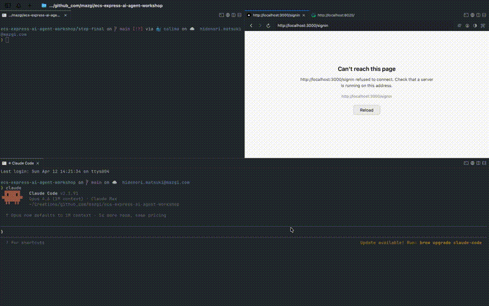

# Amazon ECS Express AI Agent Workshop

> **AWS Samples 版もあります：** 本ワークショップは AWS Samples の公式リポジトリ [aws-samples/sample-ecs-express-ai-agent-workshop](https://github.com/aws-samples/sample-ecs-express-ai-agent-workshop) でも公開されています。内容は同じですので、お好みの方をご利用ください。

AI（Claude Code 等）と対話しながら、Next.js、NestJS、Prisma、そして Amazon ECS (Express Mode) を組み合わせたプロダクションレディなフルスタックアプリを構築する、実践的なワークショップです。

単なるチュートリアルにとどまらず、最終的に構築するアプリケーションは、堅牢なユーザー認証の実装や OAuth2 Identity Provider（IdP）とのシームレスな連携が可能な、本番環境にも対応できる基盤となります。

実現したいアプリのアイデアがありますか？それとも Next.js や AWS クラウドインフラのスキルを磨きたいですか？どちらの場合でも、このワークショップはプロダクションレディな基盤と、そこに素早くたどり着くための AI 駆動ワークフローを提供します。

各 `step-*` ディレクトリはプロジェクトの自己完結型スナップショットです。各ステップの `prompts.ja.md` に従って AI エージェントにコードの記述、インフラのプロビジョニング、プロジェクトの進化を指示し、モダンな AI 駆動の開発ワークフローを体験しましょう。



## 技術スタックと選定理由

本ワークショップでは、モダンで本番環境対応の技術スタックを使用しています。これらのツールは堅牢な機能だけでなく、**その構造化された性質が AI エージェント（LLM）にとってコードの生成やリファクタリングを高い予測性で行えるため**に選定されました。

<details>
<summary><strong>技術スタックと設計選択の詳細を見る（クリックで展開）</strong></summary>

### インフラ & DevOps
* **Amazon ECS Express Mode:** コンテナデプロイの「イージーボタン」として導入され、ALB、ネットワーキング、スケーリングを自動化します。面倒なボイラープレートを排除し、AI が本番グレードの環境を即座にプロビジョニングできます。
* **Terraform（IaC）:** 宣言的インフラの業界標準。AI エージェントは HCL の記述に優れており、作成から安全なクリーンアップまでシームレスで高い再現性を持つワークフローを実現します。
* **Docker & Docker Compose:** 一貫した実行を保証するコンテナ化。AI エージェントは複雑なマルチコンテナのローカル環境用の `docker-compose.yml` 設定を容易に生成できます。

### アプリケーション & データベース
* **Next.js（フロントエンド）:** 業界標準の React フレームワークで、AI によるインタラクティブな UI の迅速な構築の予測可能な基盤として機能します。
* **NestJS（バックエンド API）:** 高度に構造化されたモジュラーアーキテクチャ（OOP/DI）を持つ TypeScript ベースのフレームワーク。AI が既存のロジックを壊すことなく、予測可能な形で機能追加やコードリファクタリングを行うことが非常に容易です。
* **Prisma（ORM）:** 完全に型安全な ORM。AI に望む構造を指示するだけで、スキーマ作成、マイグレーション、TypeScript 型生成をシームレスに処理できます。

### 品質保証
* **Playwright（E2E テスト）:** エンドツーエンドテストのためのモダンなフレームワーク。AI がコード生成を加速する中、AI に Playwright テストを書かせることは、生成されたコードが実際に動作することを検証するベストプラクティスです。

</details>

## 対象者

本ワークショップは以下の方を対象としています：

* **フルスタック開発者** — AI 駆動開発の未来を体験したい方。
* **フロントエンド/バックエンドエンジニア** — DevOps の専門家にならずとも、本番環境対応のアプリケーションを AWS にデプロイする方法を学びたい方。
* **テックリード & アーキテクト** — AI 生成と相性の良いモダンなインフラ設計パターン（永続レイヤーとエフェメラルレイヤーの分離など）を探している方。

## 学べること

本ワークショップを完了すると、以下ができるようになります：

* AI エージェント（Claude Code など）を使ってフルスタックコードの生成、リファクタリング、テストを行う。
* Terraform と新しい **Amazon ECS Express Mode** を使って AWS インフラをプロビジョニングする。
* コンテナ化された環境（Docker）でモダンな Node.js スタック（Next.js、NestJS、Prisma）を管理する。
* 「使い捨て環境」パターンを習得して、クラウドコストを効果的にコントロールする。

## 所要時間 & コスト見積もり

* **所要時間：** 2 〜 3 時間
* **AWS コスト見積もり：** 5 ドル未満（ワークショップ終了後すぐにエフェメラルレイヤーを破棄した場合。**注意：** RDS と ECS は稼働中に時間単位で課金されます。）

> **休憩を取りましょう！** このワークショップは内容が濃く、多くのトピックをカバーします。一気にすべてを終わらせようとしないでください。ステップの間に休憩を取り、体を伸ばし、リフレッシュしましょう。いつでも任意のステップで中断し、後から再開できます — 各ステップディレクトリは自己完結型のスナップショットなので、進捗が失われることはありません。リフレッシュした頭で取り組むことが、より良い学習成果につながります。

> **学習効果を最大化しましょう！** このワークショップを最大限に活用するために、AI の処理を待っている間に `prompts.md` や生成されたコードを読むことを強くおすすめします。AI が*何を*構築しているのか、*なぜ*そうしているのかを理解することは、最終的な成果物と同じくらい価値があります。すべてを一度に終わらせる必要はありません — 自分のペースでじっくり進めてください。

## 前提条件

* **知識：** TypeScript と Docker の基本的な理解。AWS や Terraform の深い専門知識は不要です（AI がサポートします！）。
* **環境：**
  * Docker Engine + Docker Compose（例: [Docker Desktop](https://www.docker.com/products/docker-desktop/)、[Podman](https://podman.io/)、[Colima](https://github.com/abiosoft/colima)）
  * 管理者アクセスが設定された AWS CLI
  * AI エージェントツール（例: [Claude Code](https://claude.ai/claude-code)、[Cursor](https://www.cursor.com/)、[GitHub Copilot](https://github.com/features/copilot)）

## 使い方

本ワークショップでは、AIエージェントにコードを生成させながらプロジェクトを進化させていきます。あなた自身の変更履歴を残すため、まずは右上の **"Fork"** ボタンからこのリポジトリを自分の GitHub アカウントへコピーし、それをローカルに `clone` してスタートしてください。

```bash
# YOUR_USERNAME をご自身の GitHub アカウント名に置き換えて実行してください
git clone https://github.com/YOUR_USERNAME/ecs-express-ai-agent-workshop.git
cd ecs-express-ai-agent-workshop
```

1. ステップディレクトリを選択（`step-0/` から開始）
2. ステップの `README.md` と `prompts.ja.md` を読んでゴールを把握
3. `docker compose up` で実際に動かしてみる
4. AI エージェントで開く
5. `prompts.ja.md` のプロンプトに従って次のステップに向けてビルド
6. 結果を次のステップディレクトリと比較

## オプション学習パス：自分のリポジトリでゼロから構築

より実践的な体験のために、自分の GitHub リポジトリを作成し、プロジェクト全体をゼロから構築できます：

1. 新しい空の GitHub リポジトリを作成し、AI エージェントで開く
2. `step-0/prompts.ja.md` の内容を AI に渡して step-1 を生成
3. 結果をコミットし、`step-1/prompts.ja.md` で step-2 を構築、以降も同様に続ける
4. step-final に到達するまで繰り返す

> **ヒント：** AI が壊れたコードを生成した場合は、対応する `step-*` ディレクトリの内容をリポジトリにコピーして正常な状態にリセットし、そこから続行できます。

## トラブルシューティング：AI エージェントが期待通りに動作しない場合

大規模言語モデル（LLM）は非決定的であるため、生成されるコードは実行ごとにわずかに異なり、エラーが発生することもあります。これは AI 駆動開発における自然で想定された現象です。行き詰まった場合は、以下の方法を試してください：

1. **エラーを AI にフィードバックする（自己修復）** — バグやエラーが発生してもパニックにならないでください。エラーログやターミナル出力をコピーして AI エージェントに貼り付け、「このエラーを修正して」と依頼しましょう。エラーのスクリーンショットを貼り付けることもできます — 最近の AI エージェントは画像も理解できます。AI にコンテキストを理解させ、自らのミスをトラブルシュートさせることは、非常に価値のあるスキルであり、この学習体験の核心です。

2. **動作するスナップショットから再開する（エスケープハッチ）** — AI がループに陥ったり、コードが修復困難なほど壊れた場合は、組み込みのエスケープハッチがあります。ローカルの変更を破棄する（例：`git checkout .`）か、次の `step-*` ディレクトリに直接移動してください。各ステップディレクトリは正しく実装されたプロジェクトの自己完結型スナップショットなので、いつでも正常な状態からワークショップを安全に再開できます。

3. **AI のトークンが不足した場合** — 本ワークショップでは大量のコード生成を行うため、特に後半のステップでは多くのトークンを消費する可能性があります。プランの使用量制限に達した場合：
   - **[Claude Max プラン](https://claude.ai/upgrade)** — Claude Code の使用量上限が大幅に引き上げられます。
   - **[Claude Code with Amazon Bedrock](https://docs.anthropic.com/en/docs/claude-code/bedrock)** — AWS アカウントを使って Bedrock 経由で Claude を直接呼び出せます。従量課金制でトークン上限がありません。本ワークショップで既に AWS アカウントをお持ちの方に最適です。
   - **ステップスナップショットを活用** — いつでも次の `step-*` ディレクトリにスキップして、動作する状態から続けることができます。

## ステップ

### [step-0](step-0/README.ja.md) — ゼロからスタート

空のディレクトリです。プロンプトに従ってすべてをゼロから作成します。

**次へ:** [step-0/prompts.ja.md](step-0/prompts.ja.md) に従って、Docker Compose と Playwright E2E テストを含む Next.js プロジェクトを作成します。

### [step-1](step-1/README.ja.md) — 空の Next.js アプリ

空の Next.js App Router プロジェクトに、ローカル開発用の Docker Compose と Playwright E2E テストが含まれています。バックエンドやインフラはありません。

**含まれるもの:**
- Next.js 16 App Router（TypeScript）
- Docker Compose（`web` + `web-e2e-tests` サービス）
- Playwright スモークテスト

**次へ:** [step-1/prompts.ja.md](step-1/prompts.ja.md) に従って、AWS インフラ（Terraform）、CI/CD（GitHub Actions）、本番用 Docker ビルドを追加します。

### [step-2](step-2/README.ja.md) — ECS Express Mode 上の Next.js

Next.js アプリに、Amazon ECS Express Mode へデプロイするための Terraform IaC と GitHub Actions による CI/CD が含まれています。フロントエンドのみで、バックエンドやデータベースはありません。

**step-1 からの追加内容:**
- Terraform IaC（永続: VPC、ECR、IAM；エフェメラル: ECS Express Gateway）
- GitHub Actions ワークフロー（E2E テスト、イメージビルド/プッシュ、IaC plan/apply）
- Web 用本番 Dockerfile
- OIDC セットアップとクラウドデプロイドキュメント

**次へ:** [step-2/prompts.ja.md](step-2/prompts.ja.md) に従って、ヘルスチェックと Git SHA 表示を備えた最小限の NestJS バックエンドを追加します。

### [step-3](step-3/README.ja.md) — ECS Express Mode 上の Next.js + NestJS（ヘルスチェック）

Next.js フロントエンドと最小限の NestJS バックエンド（GIT_SHA 付きヘルスチェックと Swagger）を、Amazon ECS Express Mode にデプロイします。

**step-2 からの追加内容:**
- NestJS 11 バックエンド（`GET /health` エンドポイント、Git SHA を返す）
- Swagger UI（`/api`、非本番環境）
- バックエンド用 Dockerfile、ECR リポジトリ、セキュリティグループ、ECS Express Gateway サービス
- Web アプリがバックエンドの Git SHA を取得・表示
- Docker Compose にバックエンドサービスを追加

**次へ:** [step-3/prompts.ja.md](step-3/prompts.ja.md) に従って、PostgreSQL、Prisma ORM、Items CRUD を追加します。

### [step-4](step-4/README.ja.md) — ECS Express Mode 上の Next.js + NestJS（Items CRUD）

Next.js フロントエンドと、ヘルスチェックおよび Items CRUD（PostgreSQL + Prisma）を備えた NestJS バックエンドを、Amazon ECS Express Mode にデプロイします。

**step-3 からの追加内容:**
- PostgreSQL 17 データベース
- Prisma ORM（Item モデル）
- Items CRUD API（`POST /items`、`GET /items`、`DELETE /items/:id`）— 認証なし
- Web アプリにアイテム一覧、作成フォーム、削除ボタン
- Items E2E テスト
- Terraform に RDS PostgreSQL、プライベートサブネット、NAT ゲートウェイ
- DATABASE_URL 用 Secrets Manager

**次へ:** [step-4/prompts.ja.md](step-4/prompts.ja.md) に従って、メール/パスワード認証（JWT）とユーザースコープのアイテムを追加します。

### [step-5](step-5/README.ja.md) — ECS Express Mode 上の Next.js + NestJS（認証 + Items CRUD）

Next.js フロントエンドと、メール/パスワード認証（JWT）およびユーザースコープの Items CRUD（PostgreSQL + Prisma）を備えた NestJS バックエンドを、Amazon ECS Express Mode にデプロイします。

**step-4 からの追加内容:**
- メール/パスワードによるサインアップ・サインイン（JWT トークン）
- Prisma の User モデル（ユーザースコープのアイテム）
- Items エンドポイントに JWT 認証ガード（所有権チェック）
- サインイン・サインアップページ（AuthContext 付き）
- ダッシュボード（ユーザープロフィール）と認証済みアイテムページ
- ナビゲーションヘッダー（ダッシュボード、アイテム、サインアウト）
- Terraform に JWT シークレットと DATABASE_URL 用 Secrets Manager

**次へ:** [step-5/prompts.ja.md](step-5/prompts.ja.md) に従って、OAuth2、メール認証、TOTP MFA、国際化を追加します。

### [step-final](step-final/README.ja.md) — フルスタックアプリ

すべての機能を備えた完成版アプリケーション — OAuth2 認証、メール認証、TOTP MFA、国際化など。

**step-5 からの追加内容:**
- OAuth2 認証（Apple、Discord、GitHub、Google、X/Twitter）
- メール認証とパスワードリセットフロー
- TOTP MFA（二要素認証）とリカバリーコード
- SMTP メール連携（ローカル開発用 Mailpit）
- 国際化（英語 + 日本語）
- OAuth プロバイダーのアカウントリンク/リンク解除
- 設定ページ（メール、MFA、連携アカウント、テーマ）
- バックエンドと Web の完全な E2E テストスイート

## インフラ設計：永続レイヤーとエフェメラルレイヤー

本ワークショップでは、Terraform コードを **永続（デフォルト）** と **エフェメラル** の 2 つのレイヤーに分割しています。

このアーキテクチャの主な目的は、学習中のクラウドコストを最小限に抑えつつ、何度でも構築・破棄できるクリーンで再現可能な実験環境を維持することです。

### 永続レイヤー

**主なリソース：** VPC（ネットワークインフラ）、ECR（コンテナレジストリ）、IAM ロール、セキュリティグループなど。

**特徴：** 一度作成するとほとんど変更されず、維持コストはほぼ発生しません。ワークショップ期間中を通じて保持する「基盤」として機能します。

### エフェメラルレイヤー

**主なリソース：** ECS（Fargate コンテナ実行環境）、ALB（ロードバランサー）、RDS（`db.t4g.micro` PostgreSQL）。

**特徴：** 実行中に時間単位で継続的に課金されるリソースをこのレイヤーに集約しています。作業中にのみ `terraform apply` を行い、作業終了時にこのレイヤーを `terraform destroy` することで、アイドルコストを大幅に削減できます。

### なぜデータベース（RDS）も使い捨てなのか？

本番環境では通常、データを保護するためにデータベースは永続レイヤーに配置されます。しかし、本ワークショップでは意図的にデータベースをエフェメラルレイヤーに含めています。

- **徹底的なコスト管理：** 非常にコスト効率の良い `db.t4g.micro` インスタンスを使用していますが、24 時間 365 日稼働させると課金が発生します。コンピュートリソースと一緒にグループ化することで、消し忘れを防ぎ、予期しない請求を回避できます。
- **クリーンな状態からの再開：** AI エージェントの開発では、プロンプトやロジックの調整に伴い、スキーマ変更やテストデータの再作成が頻繁に必要になります。環境全体を破棄・再作成することで、残留データやスキーマの不整合によるバグを回避し、常に IaC（Infrastructure as Code）で定義されたクリーンな状態から開発を再開できます。

> **注意：** エフェメラルレイヤーを破棄すると、DB 内のすべてのデータが完全に削除されます。これは「使い捨て環境」のコンセプトを採用した、本ワークショップの意図的な設計です。

## ライセンス

[MIT](LICENSE)
