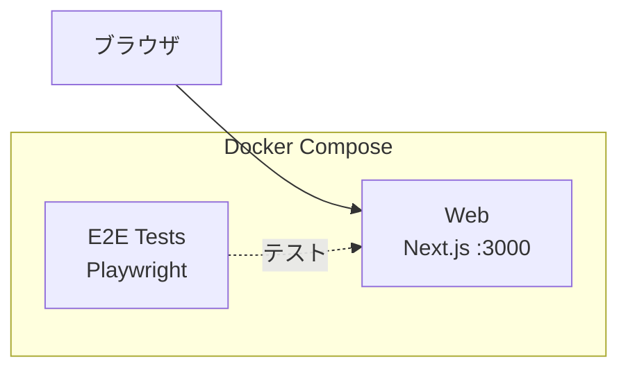

# Step 1 — 空の Next.js アプリ

出発点：Playwright E2E テスト付きの空の Next.js App Router プロジェクトです。

## 開始時のアーキテクチャ

以下の図は、このステップを**開始した時点で既にあるもの**を示しています — 最終目標ではありません。完了後に何が構築されるかは[完了後の期待される出力](#完了後の期待される出力)を参照してください。



## 前提条件

- Docker Engine + Docker Compose（例: [Docker Desktop](https://www.docker.com/products/docker-desktop/)、[Podman](https://podman.io/)、[Colima](https://github.com/abiosoft/colima)）

## クイックスタート

```sh
docker compose up
```

http://localhost:3000 を開くと、デフォルトの Next.js ページが表示されます。

## E2E テストの実行

```sh
docker compose --profile=e2e-tests run --rm web-e2e-tests
```

## プロジェクト構成

```
.
├── compose.yaml
├── Dockerfiles.d/
│   ├── web/               # Next.js 開発用 Dockerfile
│   └── web-e2e-tests/     # Playwright 用 Dockerfile
└── web/
    ├── app/               # Next.js App Router
    └── e2e-tests/         # Playwright E2E テスト
```

## AI エージェントによる実装

次のステップ（step-2）に進むために、AI エージェント（[Claude Code](https://claude.ai/claude-code)、[Cursor](https://www.cursor.com/)、[GitHub Copilot](https://github.com/features/copilot)、[ChatGPT](https://chatgpt.com/) など）にコードを生成させることができます。

このディレクトリの [prompts.ja.md](prompts.ja.md) の内容をコピーして AI エージェントに渡してください。正しく実行されれば、手動の作業なしで step-2 と同等の環境が構築されます。

> **注意：** プロンプトにより ECR リポジトリと ECS Express Gateway を含む Terraform IaC、および CI/CD 用の GitHub Actions ワークフローが作成されます。GitHub Actions でクラウドデプロイを行うには、以下が必要です：
> - GitHub と AWS 間の OIDC 認証を設定 — [step-2 docs/oidc-setup.md](../step-2/docs/oidc-setup.md) を参照
> - GitHub Actions の変数とシークレットを設定 — [step-2 docs/ci.md](../step-2/docs/ci.md) を参照

<details>
<summary><strong>用語解説：コンテナレジストリ、ECR、ECS、IaC、CI/CD（クリックで展開）</strong></summary>

**コンテナレジストリとは？**

コンテナレジストリは、コンテナイメージの保管サービスです。Docker イメージをビルドした後、レジストリにプッシュすることで、他のマシン（クラウドサーバーなど）がそのイメージをプルして実行できるようになります。「Docker イメージ版の GitHub」と考えるとわかりやすいです。

**Amazon ECR とは？**

[Amazon ECR（Elastic Container Registry）](https://aws.amazon.com/ecr/) は、AWS のマネージドコンテナレジストリです。Docker イメージを ECR にプッシュすると、ECS などの AWS サービスがそこからイメージをプルしてアプリケーションを実行します。本ワークショップでは、Terraform が Web とバックエンドのイメージ用に ECR リポジトリを作成します。

**Amazon ECS とは？**

[Amazon ECS（Elastic Container Service）](https://aws.amazon.com/ecs/) は、クラウドでコンテナを実行するための AWS のマネージドサービスです。[ECS Express Mode](https://aws.amazon.com/blogs/containers/introducing-amazon-ecs-express/) は、ロードバランサー、ネットワーキング、オートスケーリングを自動的にプロビジョニングすることでデプロイをさらに簡素化し、最小限の設定で Docker イメージから本番 URL まで構築できます。

**IaC（Infrastructure as Code）とは？**

IaC は、インフラ（サーバー、ネットワーク、データベース）を手動設定ではなくコードファイルで管理する手法です。[Terraform](https://www.terraform.io/) は最も人気のある IaC ツールの一つで、`.tf` ファイルに望む状態を記述すると、Terraform がクラウドリソースの作成・更新・削除を行います。これによりインフラが再現可能でバージョン管理でき、AI エージェントによる生成も容易になります。

**CI/CD とは？**

CI/CD（継続的インテグレーション / 継続的デプロイ）は、コードのテストとデプロイのプロセスを自動化します。[GitHub Actions](https://github.com/features/actions) は GitHub に組み込まれた CI/CD プラットフォームで、コードをプッシュすると自動的にテストを実行し、Docker イメージをビルドし、クラウドにデプロイします。本ワークショップでは、AI エージェントがこれらのワークフローファイルを生成します。

</details>

## 完了後の期待される出力

プロンプトを完了すると、step-2 と同等のプロジェクトが構築されます：

- `iac/` 配下に Terraform IaC（永続 + エフェメラルレイヤー）
- `.github/` 配下に GitHub Actions ワークフロー
- Web 用本番 Dockerfile（`Dockerfiles.d/web-build/`）
- `docs/` 配下にクラウドデプロイドキュメント
- ローカル開発は引き続き動作：`docker compose up` → http://localhost:3000

**次のステップに進む前のクリーンアップ：**

```bash
docker compose down --remove-orphans
```

---

[前へ: step-0 — ゼロからスタート](../step-0/README.ja.md) | [次へ: step-2 — ECS Express Mode 上の Next.js](../step-2/README.ja.md)
