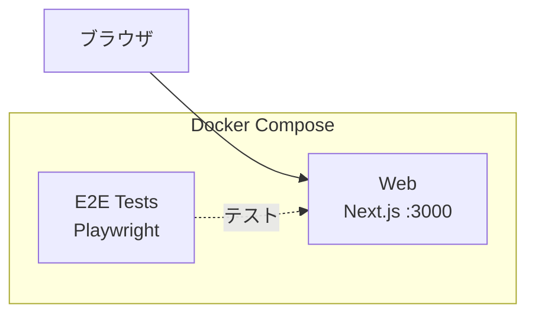

# Step 1 — 空の Next.js アプリ

出発点：Playwright E2E テスト付きの空の Next.js App Router プロジェクトです。

## 開始時のアーキテクチャ

以下の図は、このステップを**開始した時点で既にあるもの**を示しています — 最終目標ではありません。完了後に何が構築されるかは[完了後の期待される出力](#完了後の期待される出力)を参照してください。



## 前提条件

- Docker Engine + Docker Compose（例: [Docker Desktop](https://www.docker.com/products/docker-desktop/)、[Podman](https://podman.io/)、[Colima](https://github.com/abiosoft/colima)）

## クイックスタート

```sh
docker compose up
```

http://localhost:3000 を開くと、デフォルトの Next.js ページが表示されます。

## E2E テストの実行

```sh
docker compose --profile=e2e-tests run --rm web-e2e-tests
```

## プロジェクト構成

```
.
├── compose.yaml
├── Dockerfiles.d/
│   ├── web/               # Next.js 開発用 Dockerfile
│   └── web-e2e-tests/     # Playwright 用 Dockerfile
└── web/
    ├── app/               # Next.js App Router
    └── e2e-tests/         # Playwright E2E テスト
```

## AI エージェントによる実装

次のステップ（step-2）に進むために、AI エージェント（[Claude Code](https://claude.ai/claude-code)、[Cursor](https://www.cursor.com/)、[GitHub Copilot](https://github.com/features/copilot)、[ChatGPT](https://chatgpt.com/) など）にコードを生成させることができます。

このディレクトリの [prompts.ja.md](prompts.ja.md) の内容をコピーして AI エージェントに渡してください。正しく実行されれば、手動の作業なしで step-2 と同等の環境が構築されます。

> **注意：** プロンプトにより ECR リポジトリと ECS Express Gateway を含む Terraform IaC が作成されます。クラウドデプロイ時には Docker イメージをビルドして ECR にプッシュする必要があります — 手順は [step-2 イメージのビルドとプッシュ](../step-2/README.ja.md#イメージのビルドとプッシュ) を参照してください。

## 完了後の期待される出力

プロンプトを完了すると、step-2 と同等のプロジェクトが構築されます：

- `iac/` 配下に Terraform IaC（永続 + エフェメラルレイヤー）
- `.github/` 配下に GitHub Actions ワークフロー
- Web 用本番 Dockerfile（`Dockerfiles.d/web-build/`）
- `docs/` 配下にクラウドデプロイドキュメント
- ローカル開発は引き続き動作：`docker compose up` → http://localhost:3000

---

[前へ: step-0 — ゼロからスタート](../step-0/README.ja.md) | [次へ: step-2 — ECS Express Mode 上の Next.js](../step-2/README.ja.md)
