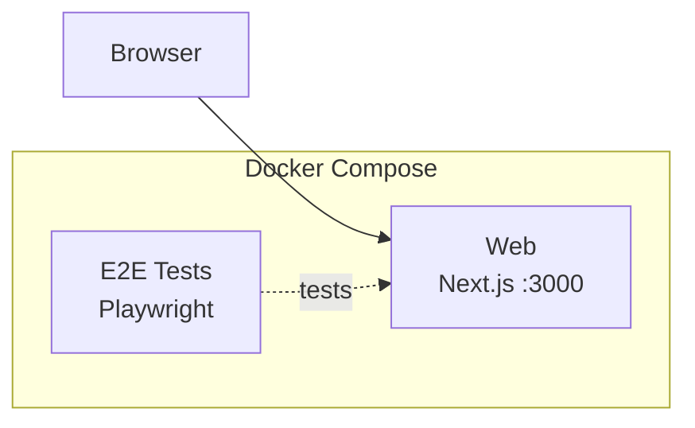

# Step 1 — Empty Next.js App

Starting point: an empty Next.js App Router project with Playwright E2E tests.

## Architecture at Start

The following diagram shows what you **already have** when you begin this step — not the final goal. See [Expected Output After Completion](#expected-output-after-completion) for what you will build.



## Prerequisites

- Docker Engine + Docker Compose (e.g. [Docker Desktop](https://www.docker.com/products/docker-desktop/), [Podman](https://podman.io/), [Colima](https://github.com/abiosoft/colima))

## Quick Start

```sh
docker compose up
```

Open http://localhost:3000 to see the default Next.js page.

## Run E2E Tests

```sh
docker compose --profile=e2e-tests run --rm web-e2e-tests
```

## Project Structure

```
.
├── compose.yaml
├── Dockerfiles.d/
│   ├── web/               # Dockerfile for Next.js dev
│   └── web-e2e-tests/     # Dockerfile for Playwright
└── web/
    ├── app/               # Next.js App Router
    └── e2e-tests/         # Playwright E2E tests
```

## Implementation via AI Agent

To prepare for the next step (step-2), you can have an AI agent (such as [Claude Code](https://claude.ai/claude-code), [Cursor](https://www.cursor.com/), [GitHub Copilot](https://github.com/features/copilot), or [ChatGPT](https://chatgpt.com/)) generate the code for you.

Copy the contents of [prompts.md](prompts.md) in this directory and provide them to your AI agent. If executed correctly, you will have an environment equivalent to step-2 without manual intervention.

> **Note:** The prompts will create Terraform IaC with ECR repositories and ECS Express Gateway, plus GitHub Actions workflows for CI/CD. To use GitHub Actions for cloud deployment, you will need to:
> - Set up OIDC authentication between GitHub and AWS — see [step-2 docs/oidc-setup.md](../step-2/docs/oidc-setup.md)
> - Configure GitHub Actions variables and secrets — see [step-2 docs/ci.md](../step-2/docs/ci.md)

<details>
<summary><strong>Glossary: ECS, IaC, CI/CD (Click to expand)</strong></summary>

**What is Amazon ECS?**

[Amazon ECS (Elastic Container Service)](https://aws.amazon.com/ecs/) is AWS's managed service for running containers in the cloud. [ECS Express Mode](https://aws.amazon.com/blogs/containers/introducing-amazon-ecs-express/) simplifies deployment further by automatically provisioning load balancers, networking, and auto-scaling — letting you go from a Docker image to a production URL with minimal configuration.

**What is IaC (Infrastructure as Code)?**

IaC is the practice of managing infrastructure (servers, networks, databases) through code files rather than manual configuration. [Terraform](https://www.terraform.io/) is one of the most popular IaC tools — you write `.tf` files describing the desired state, and Terraform creates, updates, or deletes cloud resources to match. This makes infrastructure reproducible, version-controlled, and easy for AI agents to generate.

**What is CI/CD?**

CI/CD (Continuous Integration / Continuous Deployment) automates the process of testing and deploying code. [GitHub Actions](https://github.com/features/actions) is a CI/CD platform built into GitHub — when you push code, it automatically runs tests, builds Docker images, and deploys to the cloud. In this workshop, the AI agent generates these workflow files for you.

</details>

## Expected Output After Completion

After completing the prompts, you should have a project equivalent to step-2 with:

- Terraform IaC under `iac/` (persistent + ephemeral layers)
- GitHub Actions workflows under `.github/`
- A production Dockerfile for web (`Dockerfiles.d/web-build/`)
- Cloud deployment documentation under `docs/`
- Local development still works: `docker compose up` → http://localhost:3000

---

[Prev: step-0 — Starting from Scratch](../step-0/README.md) | [Next: step-2 — Next.js on ECS Express Mode](../step-2/README.md)
