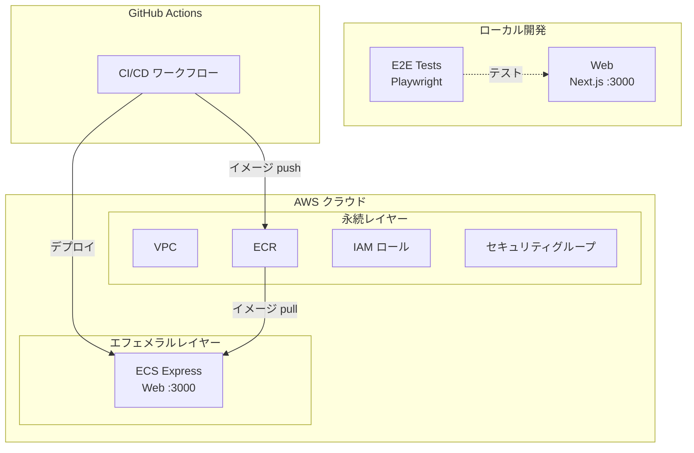

# Step 2 — ECS Express Mode 上の Next.js

AWS ECS Express Mode へデプロイするための IaC（Terraform）と GitHub Actions による CI/CD を備えた Next.js アプリです。

## サービス

| サービス | 技術 | ポート |
|---------|------|--------|
| web | Next.js 16 | 3000 |

## 開始時のアーキテクチャ

以下の図は、このステップを**開始した時点で既にあるもの**を示しています — 最終目標ではありません。完了後に何が構築されるかは[完了後の期待される出力](#完了後の期待される出力)を参照してください。



## 前提条件

- Docker Engine + Docker Compose（例: [Docker Desktop](https://www.docker.com/products/docker-desktop/)、[Podman](https://podman.io/)、[Colima](https://github.com/abiosoft/colima)）

## クイックスタート

```sh
docker compose up
```

http://localhost:3000 を開くとアプリが表示されます。

## E2E テストの実行

```sh
docker compose --profile=e2e-tests run --rm web-e2e-tests
```

## プロジェクト構成

```
.
├── compose.yaml
├── web/
│   ├── app/               # Next.js App Router
│   └── e2e-tests/         # Playwright E2E テスト
├── iac/                   # Terraform IaC（AWS）
├── Dockerfiles.d/
├── .github/               # GitHub Actions ワークフロー + カスタムアクション
└── docs/
```

## クラウドデプロイ（Terraform）

詳細は [docs/cloud-deployment-aws.md](docs/cloud-deployment-aws.md) を参照してください。概要：

```sh
# 1. 変数の設定
cp iac/aws/terraform.tfvars.example iac/aws/terraform.tfvars
cp iac/aws/ephemeral/terraform.tfvars.example iac/aws/ephemeral/terraform.tfvars

# 2. 永続インフラのデプロイ（VPC、ECR、IAM）
source .env
docker compose --profile=iac run --rm iac terraform -chdir=aws init \
  -backend-config="bucket=$AWS_TF_STATE_BUCKET" \
  -backend-config="region=$AWS_TF_STATE_REGION"
docker compose --profile=iac run --rm iac terraform -chdir=aws apply -var-file=terraform.tfvars

# 3. Docker イメージをビルドして ECR にプッシュ後、エフェメラルインフラをデプロイ（ECS Express Gateway）
docker compose --profile=iac run --rm iac terraform -chdir=aws/ephemeral init \
  -backend-config="bucket=$AWS_TF_STATE_BUCKET" \
  -backend-config="region=$AWS_TF_STATE_REGION"
docker compose --profile=iac run --rm iac terraform -chdir=aws/ephemeral apply -var-file=terraform.tfvars
```

## AI エージェントによる実装

次のステップ（step-3）に進むために、AI エージェント（[Claude Code](https://claude.ai/claude-code)、[Cursor](https://www.cursor.com/)、[GitHub Copilot](https://github.com/features/copilot)、[ChatGPT](https://chatgpt.com/) など）にコードを生成させることができます。

このディレクトリの [prompts.md](prompts.md) の内容をコピーして AI エージェントに渡してください。正しく実行されれば、手動の作業なしで step-3 と同等の環境が構築されます。

## 完了後の期待される出力

プロンプトを完了すると、step-3 と同等のプロジェクトが構築されます：

- ヘルスチェックエンドポイントを持つ NestJS バックエンド
- **http://localhost:4000/health** のレスポンス：
  ```json
  { "status": "ok", "gitSha": "abc1234" }
  ```
- **http://localhost:4000/api** — Swagger UI（非本番環境）
- **http://localhost:3000** — **「ECS Express Workshop」** タイトルとバックエンドの Git SHA を表示する Web ページ
- E2E テストで Git SHA の表示を検証

---

[前へ: step-1 — 空の Next.js アプリ](../step-1/README.ja.md) | [次へ: step-3 — Next.js + NestJS（ヘルスチェック）](../step-3/README.ja.md)
