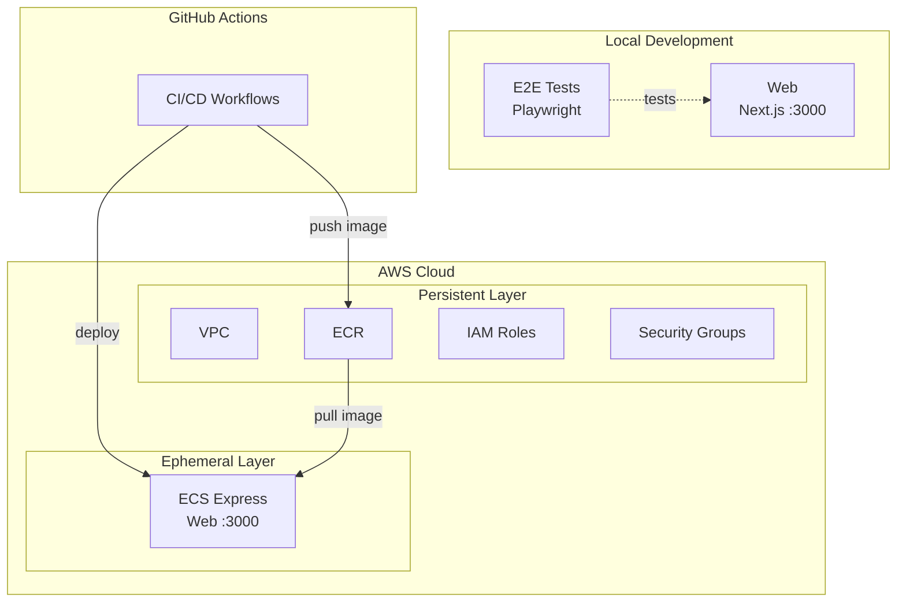

# Step 2 — Next.js on ECS Express Mode

Next.js app with IaC (Terraform) for deploying to Amazon ECS Express Mode, plus CI/CD via GitHub Actions.

## Services

| Service | Technology | Port |
|---------|-----------|------|
| web | Next.js 16 | 3000 |

## Architecture at Start

The following diagram shows what you **already have** when you begin this step — not the final goal. See [Expected Output After Completion](#expected-output-after-completion) for what you will build.



## Prerequisites

- Docker Engine + Docker Compose (e.g. [Docker Desktop](https://www.docker.com/products/docker-desktop/), [Podman](https://podman.io/), [Colima](https://github.com/abiosoft/colima))
- An AWS account with administrator access (optional — needed only if you want to deploy to the cloud)
- A GitHub repository (optional — needed only if you want to use the GitHub Actions CI/CD workflows in `.github/`)

## Run This Step

```sh
cp .example.env .env   # Edit if needed — see comments inside
docker compose up
```

Open http://localhost:3000 to see the app.

## Run E2E Tests

```sh
docker compose --profile=e2e-tests run --rm web-e2e-tests
```

## Project Structure

```
.
├── compose.yaml
├── web/
│   ├── app/               # Next.js App Router
│   └── e2e-tests/         # Playwright E2E tests
├── iac/                   # Terraform IaC (AWS)
├── Dockerfiles.d/
├── .github/               # GitHub Actions workflows + custom actions
└── docs/
```

## Cloud Deployment (Terraform)

Cloud deployment is **optional** — you can complete this workshop using only local Docker containers. If you want to deploy your application to AWS, run the Terraform commands below via `docker compose` (no local Terraform installation required).

See [docs/cloud-deployment-aws.md](docs/cloud-deployment-aws.md) for full details. To use GitHub Actions for CI/CD, you will need to set up [OIDC authentication](docs/oidc-setup.md) and configure [GitHub Actions variables and secrets](docs/ci.md). Quick summary:

```sh
# 1. Configure variables
cp iac/aws/terraform.tfvars.example iac/aws/terraform.tfvars
cp iac/aws/ephemeral/terraform.tfvars.example iac/aws/ephemeral/terraform.tfvars

# 2. Deploy persistent infrastructure (VPC, ECR, IAM)
source .env
docker compose --profile=iac run --rm iac terraform -chdir=aws init \
  -backend-config="bucket=$AWS_TF_STATE_BUCKET" \
  -backend-config="region=$AWS_TF_STATE_REGION"
docker compose --profile=iac run --rm iac terraform -chdir=aws apply -var-file=terraform.tfvars

# 3. Build and push Docker images to ECR
aws ecr get-login-password --region $AWS_REGION | \
  docker login --username AWS --password-stdin $ACCOUNT_ID.dkr.ecr.$AWS_REGION.amazonaws.com
docker build -f Dockerfiles.d/web-build/Dockerfile \
  -t $ACCOUNT_ID.dkr.ecr.$AWS_REGION.amazonaws.com/${APP_UNIQUE_ID}-web:latest \
  web/app
docker push $ACCOUNT_ID.dkr.ecr.$AWS_REGION.amazonaws.com/${APP_UNIQUE_ID}-web:latest

# 4. Deploy ephemeral infrastructure (ECS Express Gateway)
docker compose --profile=iac run --rm iac terraform -chdir=aws/ephemeral init \
  -backend-config="bucket=$AWS_TF_STATE_BUCKET" \
  -backend-config="region=$AWS_TF_STATE_REGION"
docker compose --profile=iac run --rm iac terraform -chdir=aws/ephemeral apply -var-file=terraform.tfvars
```

> The ECR repository URL can be found in the persistent layer Terraform output. See [docs/cloud-deployment-aws.md](docs/cloud-deployment-aws.md) for full details.

## Implementation via AI Agent

To prepare for the next step (step-3), you can have an AI agent (such as [Claude Code](https://claude.ai/claude-code), [Cursor](https://www.cursor.com/), [GitHub Copilot](https://github.com/features/copilot), or [ChatGPT](https://chatgpt.com/)) generate the code for you.

Copy the contents of [prompts.md](prompts.md) in this directory and provide them to your AI agent. If executed correctly, you will have an environment equivalent to step-3 without manual intervention.

<details>
<summary><strong>Glossary: NestJS (Click to expand)</strong></summary>

**What is NestJS?**

[NestJS](https://nestjs.com/) is a TypeScript-based backend framework for building server-side applications. It uses a highly structured, modular architecture inspired by Angular (with decorators, dependency injection, and modules), making it very predictable for AI agents to generate and extend code. In this workshop, we use NestJS as the backend API starting from the next step.

</details>

## Expected Output After Completion

After completing the prompts, you should have a project equivalent to step-3 with:

- A NestJS backend with a health check endpoint
- **http://localhost:4000/health** returns:
  ```json
  { "status": "ok", "gitSha": "abc1234" }
  ```
  > **Note:** If you are running this step as a subdirectory of the workshop repository (e.g., `step-3/`), `gitSha` will show `"undefined"` because the `.git/` directory is in the parent. This is normal. It will show a real commit hash when the project is in its own Git repository root.
- **http://localhost:4000/api** — Swagger UI (non-production)
- **http://localhost:3000** — Web page showing **"ECS Express Workshop"** title and backend Git SHA
- E2E tests verify the Git SHA is displayed

If you deployed to AWS, you can also access the same Web page from Amazon ECS. Run the following command to get the URL:

```sh
docker compose --profile=iac run --rm iac terraform -chdir=aws/ephemeral output web_url
```

Open the output URL in your browser to confirm it works.

**Cleanup before moving to the next step:**

```bash
docker compose down --remove-orphans
```

---

[Prev: step-1 — Empty Next.js App](../step-1/README.md) | [Next: step-3 — Next.js + NestJS (health check)](../step-3/README.md)
