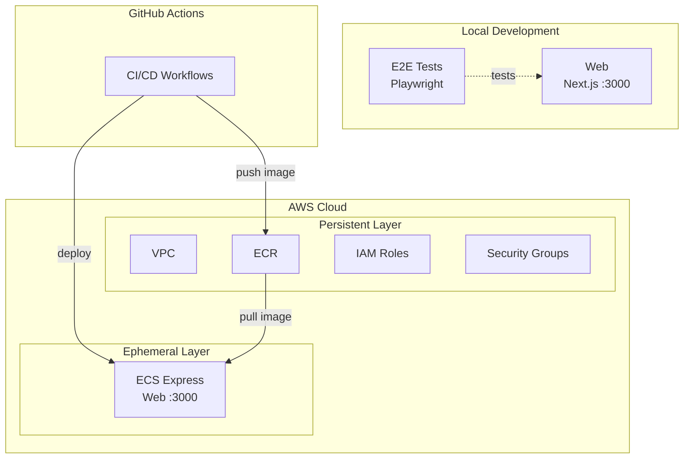

# Step 2 — Next.js on ECS Express Mode

Next.js app with IaC (Terraform) for deploying to AWS ECS Express Mode, plus CI/CD via GitHub Actions.

## Services

| Service | Technology | Port |
|---------|-----------|------|
| web | Next.js 16 | 3000 |

## Architecture



## Prerequisites

- Docker Engine + Docker Compose (e.g. [Docker Desktop](https://www.docker.com/products/docker-desktop/), [Podman](https://podman.io/), [Colima](https://github.com/abiosoft/colima))

## Quick Start

```sh
docker compose up
```

Open http://localhost:3000 to see the app.

## Run E2E Tests

```sh
docker compose --profile=e2e-tests run --rm web-e2e-tests
```

## Project Structure

```
.
├── compose.yaml
├── web/
│   ├── app/               # Next.js App Router
│   └── e2e-tests/         # Playwright E2E tests
├── iac/                   # Terraform IaC (AWS)
├── Dockerfiles.d/
├── .github/               # GitHub Actions workflows + custom actions
└── docs/
```

## Cloud Deployment (Terraform)

See [docs/cloud-deployment-aws.md](docs/cloud-deployment-aws.md) for full details. Quick summary:

```sh
# 1. Configure variables
cp iac/aws/terraform.tfvars.example iac/aws/terraform.tfvars
cp iac/aws/ephemeral/terraform.tfvars.example iac/aws/ephemeral/terraform.tfvars

# 2. Deploy persistent infrastructure (VPC, ECR, IAM)
source .env
docker compose --profile=iac run --rm iac terraform -chdir=aws init \
  -backend-config="bucket=$AWS_TF_STATE_BUCKET" \
  -backend-config="region=$AWS_TF_STATE_REGION"
docker compose --profile=iac run --rm iac terraform -chdir=aws apply -var-file=terraform.tfvars

# 3. Build and push Docker images to ECR, then deploy ephemeral infrastructure (ECS Express Gateway)
docker compose --profile=iac run --rm iac terraform -chdir=aws/ephemeral init \
  -backend-config="bucket=$AWS_TF_STATE_BUCKET" \
  -backend-config="region=$AWS_TF_STATE_REGION"
docker compose --profile=iac run --rm iac terraform -chdir=aws/ephemeral apply -var-file=terraform.tfvars
```

## Implementation via AI Agent

To prepare for the next step (step-3), you can have an AI agent (such as [Claude Code](https://claude.ai/claude-code), [Cursor](https://www.cursor.com/), [GitHub Copilot](https://github.com/features/copilot), or [ChatGPT](https://chatgpt.com/)) generate the code for you.

Copy the contents of [prompts.md](prompts.md) in this directory and provide them to your AI agent. If executed correctly, you will have an environment equivalent to step-3 without manual intervention.

## Expected Output After Completion

After completing the prompts, you should have a project equivalent to step-3 with:

- A NestJS backend with a health check endpoint
- **http://localhost:4000/health** returns:
  ```json
  { "status": "ok", "gitSha": "abc1234" }
  ```
- **http://localhost:4000/api** — Swagger UI (non-production)
- **http://localhost:3000** — Web page showing **"ECS Express Workshop"** title and backend Git SHA
- E2E tests verify the Git SHA is displayed

---

[Prev: step-1 — Empty Next.js App](../step-1/README.md) | [Next: step-3 — Next.js + NestJS (health check)](../step-3/README.md)
