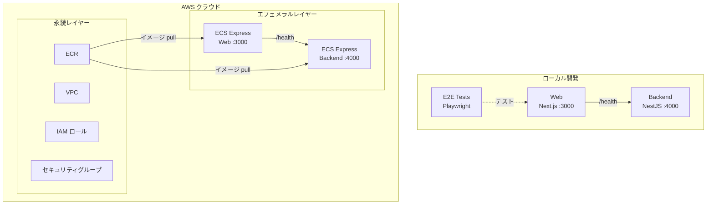

# Step 3 — ECS Express Mode 上の Next.js + NestJS（ヘルスチェックのみ）

Next.js フロントエンドと最小限の NestJS バックエンド（GIT_SHA 付きヘルスチェックのみ）を、Terraform IaC と GitHub Actions による CI/CD で AWS ECS Express Mode にデプロイします。

## サービス

| サービス | 技術 | ポート |
|---------|------|--------|
| backend | NestJS 11（ヘルスチェックのみ） | 4000 |
| web | Next.js 16 | 3000 |

## アーキテクチャ



## 前提条件

- Docker Engine + Docker Compose（例: [Docker Desktop](https://www.docker.com/products/docker-desktop/)、[Podman](https://podman.io/)、[Colima](https://github.com/abiosoft/colima)）

## クイックスタート

```sh
docker compose up
```

| URL | 説明 |
|-----|------|
| http://localhost:4000/health | バックエンドヘルスチェック |
| http://localhost:3000 | Web |

## E2E テストの実行

```sh
docker compose --profile=e2e-tests run --rm web-e2e-tests
```

## プロジェクト構成

```
.
├── compose.yaml
├── backend/               # NestJS API（ヘルスチェックのみ）
├── web/
│   ├── app/               # Next.js App Router
│   └── e2e-tests/         # Playwright E2E テスト
├── iac/                   # Terraform IaC（AWS）
├── Dockerfiles.d/
├── .github/               # GitHub Actions ワークフロー + カスタムアクション
└── docs/
```

## クラウドデプロイ（Terraform）

詳細は [docs/cloud-deployment-aws.md](docs/cloud-deployment-aws.md) を参照してください。概要：

```sh
# 1. 変数の設定
cp iac/aws/terraform.tfvars.example iac/aws/terraform.tfvars
cp iac/aws/ephemeral/terraform.tfvars.example iac/aws/ephemeral/terraform.tfvars

# 2. 永続インフラのデプロイ（VPC、ECR、IAM）
source .env
docker compose --profile=iac run --rm iac terraform -chdir=aws init \
  -backend-config="bucket=$AWS_TF_STATE_BUCKET" \
  -backend-config="region=$AWS_TF_STATE_REGION"
docker compose --profile=iac run --rm iac terraform -chdir=aws apply -var-file=terraform.tfvars

# 3. Docker イメージをビルドして ECR にプッシュ後、エフェメラルインフラをデプロイ（ECS Express Gateway）
docker compose --profile=iac run --rm iac terraform -chdir=aws/ephemeral init \
  -backend-config="bucket=$AWS_TF_STATE_BUCKET" \
  -backend-config="region=$AWS_TF_STATE_REGION"
docker compose --profile=iac run --rm iac terraform -chdir=aws/ephemeral apply -var-file=terraform.tfvars
```

## AI エージェントによる実装

次のステップ（step-4）に進むために、AI エージェント（[Claude Code](https://claude.ai/claude-code)、[Cursor](https://www.cursor.com/)、[GitHub Copilot](https://github.com/features/copilot)、[ChatGPT](https://chatgpt.com/) など）にコードを生成させることができます。

このディレクトリの [prompts.md](prompts.md) の内容をコピーして AI エージェントに渡してください。正しく実行されれば、手動の作業なしで step-4 と同等の環境が構築されます。

## 完了後の期待される出力

プロンプトを完了すると、step-4 と同等のプロジェクトが構築されます：

- Docker Compose で PostgreSQL データベースが起動
- Prisma ORM（Item モデル）
- **http://localhost:3000** — Items セクション付き Web ページ：
  - 入力フィールドと「Add」ボタンでアイテムを作成
  - 削除ボタン付きアイテム一覧
  - リストが空の場合は「No items yet」
- **http://localhost:4000/api** — Swagger UI（Items CRUD）：
  - `POST /items` — アイテム作成（`{ "name": "My item" }`）→ `201 Created`
  - `GET /items` — 全アイテム一覧 → `200 OK`
  - `DELETE /items/:id` — アイテム削除 → `204 No Content`
- E2E テストでアイテムの作成と削除を検証

---

[前へ: step-2 — ECS Express Mode 上の Next.js](../step-2/README.ja.md) | [次へ: step-4 — Next.js + NestJS（Items CRUD）](../step-4/README.ja.md)
