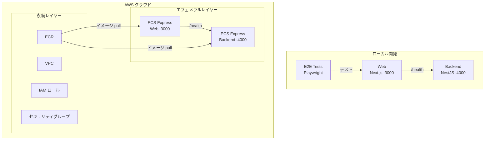

# Step 3 — ECS Express Mode 上の Next.js + NestJS（ヘルスチェックのみ）

Next.js フロントエンドと最小限の NestJS バックエンド（GIT_SHA 付きヘルスチェックのみ）を、Terraform IaC と GitHub Actions による CI/CD で Amazon ECS Express Mode にデプロイします。

## サービス

| サービス | 技術 | ポート |
|---------|------|--------|
| backend | NestJS 11（ヘルスチェックのみ） | 4000 |
| web | Next.js 16 | 3000 |

## 開始時のアーキテクチャ

以下の図は、このステップを**開始した時点で既にあるもの**を示しています — 最終目標ではありません。完了後に何が構築されるかは[完了後の期待される出力](#完了後の期待される出力)を参照してください。



## プロジェクト構成

```
.
├── compose.yaml
├── backend/               # NestJS API（ヘルスチェックのみ）
├── web/
│   ├── app/               # Next.js App Router
│   └── e2e-tests/         # Playwright E2E テスト
├── iac/                   # Terraform IaC（AWS）
├── Dockerfiles.d/
├── .github/               # GitHub Actions ワークフロー + カスタムアクション
└── docs/
```

## 前提条件

- Docker Engine + Docker Compose（例: [Docker Desktop](https://www.docker.com/products/docker-desktop/)、[Podman](https://podman.io/)、[Colima](https://github.com/abiosoft/colima)）
- 管理者権限を持つ AWS アカウント（オプション — クラウドにデプロイする場合のみ必要）
- GitHub リポジトリ（オプション — `.github/` の GitHub Actions CI/CD ワークフローを使用する場合のみ必要）

## このステップを実行する

```sh
cp .example.env .env   # 必要に応じて編集 — ファイル内のコメントを参照
docker compose up
```

| URL | 説明 |
|-----|------|
| http://localhost:4000/health | バックエンドヘルスチェック |
| http://localhost:3000 | Web |

## E2E テストの実行

```sh
docker compose --profile=e2e-tests run --rm web-e2e-tests
```

## クラウドデプロイ（Terraform）

ECS ワークショップですので、フル体験のために **AWS へのデプロイを推奨します**。Terraform コマンドはすべて `docker compose` 経由で実行するため、ホストに Terraform をインストールする必要はありません。AWS アカウントをまだお持ちでない場合は、ローカル開発で先に進めて後からデプロイすることもできます。

詳細は [docs/cloud-deployment-aws.md](docs/cloud-deployment-aws.md) を参照してください。概要：

```sh
# 1. 変数の設定
cp iac/aws/terraform.tfvars.example iac/aws/terraform.tfvars
cp iac/aws/ephemeral/terraform.tfvars.example iac/aws/ephemeral/terraform.tfvars
# terraform.tfvars を編集し、app_unique_id を設定（例: "my-workshop"）
# APP_UNIQUE_ID は AWS リソース名（ECR リポジトリ、Secrets Manager キーなど）の一意なプレフィックスです

# 2. 永続インフラのデプロイ（VPC、ECR、IAM）
source .env
docker compose --profile=iac run --rm iac terraform -chdir=aws init \
  -backend-config="bucket=$AWS_TF_STATE_BUCKET" \
  -backend-config="region=$AWS_TF_STATE_REGION"
docker compose --profile=iac run --rm iac terraform -chdir=aws apply -var-file=terraform.tfvars

# 3. Docker イメージをビルドして ECR にプッシュ
aws ecr get-login-password --region $AWS_REGION | \
  docker login --username AWS --password-stdin $ACCOUNT_ID.dkr.ecr.$AWS_REGION.amazonaws.com
docker build -f Dockerfiles.d/backend-build/Dockerfile \
  -t $ACCOUNT_ID.dkr.ecr.$AWS_REGION.amazonaws.com/${APP_UNIQUE_ID}-backend:latest \
  backend
docker push $ACCOUNT_ID.dkr.ecr.$AWS_REGION.amazonaws.com/${APP_UNIQUE_ID}-backend:latest
docker build -f Dockerfiles.d/web-build/Dockerfile \
  -t $ACCOUNT_ID.dkr.ecr.$AWS_REGION.amazonaws.com/${APP_UNIQUE_ID}-web:latest \
  web/app
docker push $ACCOUNT_ID.dkr.ecr.$AWS_REGION.amazonaws.com/${APP_UNIQUE_ID}-web:latest

# 4. エフェメラルインフラをデプロイ（ECS Express Gateway）
docker compose --profile=iac run --rm iac terraform -chdir=aws/ephemeral init \
  -backend-config="bucket=$AWS_TF_STATE_BUCKET" \
  -backend-config="region=$AWS_TF_STATE_REGION"
docker compose --profile=iac run --rm iac terraform -chdir=aws/ephemeral apply -var-file=terraform.tfvars
```

> 詳細は [docs/cloud-deployment-aws.md](docs/cloud-deployment-aws.md) を参照してください。

## AI エージェントによる実装

次のステップ（step-4）に進むために、AI エージェント（[Claude Code](https://claude.ai/claude-code)、[Cursor](https://www.cursor.com/)、[GitHub Copilot](https://github.com/features/copilot)、[ChatGPT](https://chatgpt.com/) など）にコードを生成させることができます。

このディレクトリの [prompts.ja.md](prompts.ja.md) の内容をコピーして AI エージェントに渡してください。正しく実行されれば、手動の作業なしで step-4 と同等の環境が構築されます。

> **注意：** プロンプトにより Terraform IaC に Secrets Manager と RDS リソースが作成されます。`DATABASE_URL` シークレットはエフェメラルレイヤーの Terraform が自動的に設定するため、このステップでは手動でのシークレット設定は不要です。

<details>
<summary><strong>用語解説：RDBMS、PostgreSQL、RDS、ORM、Prisma（クリックで展開）</strong></summary>

**RDBMS とは？**

RDBMS（リレーショナルデータベース管理システム）は、データを行と列のテーブルに格納し、SQL を使用してデータの照会・操作を行うデータベースです。テーブル間のリレーション（例：ユーザーが複数のアイテムを持つ）が中核機能であり、構造化されたアプリケーションデータに最適です。

**PostgreSQL とは？**

[PostgreSQL](https://www.postgresql.org/) は、信頼性、豊富な機能、標準準拠で知られる強力なオープンソースの RDBMS です。Web アプリケーションで最も人気のあるデータベースの一つです。本ワークショップでは、次のステップから PostgreSQL を使用します。

**Amazon RDS とは？**

[Amazon RDS（Relational Database Service）](https://aws.amazon.com/rds/) は、セットアップ、パッチ適用、バックアップ、スケーリングを自動的に処理するマネージドデータベースサービスです。自分でサーバーに PostgreSQL をインストール・保守する代わりに、RDS がクラウド上ですぐに使えるデータベースインスタンスを提供します。

**ORM とは？**

ORM（オブジェクトリレーショナルマッピング）は、生の SQL を書く代わりにプログラミング言語のオブジェクトを使ってデータベースとやり取りできるライブラリです。データベーステーブルをクラス/型にマッピングすることで、データベース操作を型安全でエラーの少ないものにします。

**Prisma とは？**

[Prisma](https://www.prisma.io/) は、TypeScript/JavaScript 向けのモダンで型安全な ORM です。`.prisma` スキーマファイルにデータモデルを定義すると、Prisma がデータベース照会用の完全に型付けされたクライアントを生成します。AI エージェントがスキーマを変更すると型安全なコードが自動的に得られるため、AI 駆動開発に特に適しています。

</details>

## 完了後の期待される出力

プロンプトを完了すると、step-4 と同等のプロジェクトが構築されます：

- Docker Compose で PostgreSQL データベースが起動
- Prisma ORM（Item モデル）
- **http://localhost:3000** — Items セクション付き Web ページ：
  - 入力フィールドと「Add」ボタンでアイテムを作成
  - 削除ボタン付きアイテム一覧
  - リストが空の場合は「No items yet」
- **http://localhost:4000/api** — Swagger UI（Items CRUD）：
  - `POST /items` — アイテム作成（`{ "name": "My item" }`）→ `201 Created`
  - `GET /items` — 全アイテム一覧 → `200 OK`
  - `DELETE /items/:id` — アイテム削除 → `204 No Content`
- E2E テストでアイテムの作成と削除を検証

AWS にデプロイした場合は、Amazon ECS からも同じアプリケーションにアクセスできます。以下のコマンドで URL を取得してください：

```sh
docker compose --profile=iac run --rm iac terraform -chdir=aws/ephemeral output web_url
```

出力された URL をブラウザで開いて動作を確認してください。

**次のステップに進む前のクリーンアップ：**

```bash
docker compose down --remove-orphans
```

> このステップはデータベースボリュームを使用します。データベースをリセットしたい場合は、代わりに `docker compose down --remove-orphans -v` を使用してください。

---

[前へ: step-2 — ECS Express Mode 上の Next.js](../step-2/README.ja.md) | [次へ: step-4 — Next.js + NestJS（Items CRUD）](../step-4/README.ja.md)
