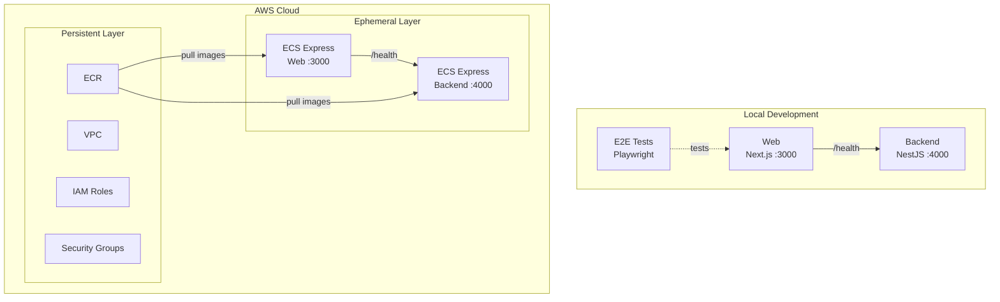

# Step 3 — Next.js + NestJS (health check only) on ECS Express Mode

Next.js frontend and a minimal NestJS backend (health check with GIT_SHA only), both deployed to Amazon ECS Express Mode with Terraform IaC and CI/CD via GitHub Actions.

## Services

| Service | Technology | Port |
|---------|-----------|------|
| backend | NestJS 11 (health check only) | 4000 |
| web | Next.js 16 | 3000 |

## Architecture at Start

The following diagram shows what you **already have** when you begin this step — not the final goal. See [Expected Output After Completion](#expected-output-after-completion) for what you will build.



## Prerequisites

- Docker Engine + Docker Compose (e.g. [Docker Desktop](https://www.docker.com/products/docker-desktop/), [Podman](https://podman.io/), [Colima](https://github.com/abiosoft/colima))
- A GitHub repository (optional — needed only if you want to use the GitHub Actions CI/CD workflows in `.github/`)

## Quick Start

```sh
cp .example.env .env   # Edit if needed — see comments inside
docker compose up
```

| URL | Description |
|-----|-------------|
| http://localhost:4000/health | Backend health check |
| http://localhost:3000 | Web |

## Run E2E Tests

```sh
docker compose --profile=e2e-tests run --rm web-e2e-tests
```

## Project Structure

```
.
├── compose.yaml
├── backend/               # NestJS API (health check only)
├── web/
│   ├── app/               # Next.js App Router
│   └── e2e-tests/         # Playwright E2E tests
├── iac/                   # Terraform IaC (AWS)
├── Dockerfiles.d/
├── .github/               # GitHub Actions workflows + custom actions
└── docs/
```

## Cloud Deployment (Terraform)

See [docs/cloud-deployment-aws.md](docs/cloud-deployment-aws.md) for full details. Quick summary:

```sh
# 1. Configure variables
cp iac/aws/terraform.tfvars.example iac/aws/terraform.tfvars
cp iac/aws/ephemeral/terraform.tfvars.example iac/aws/ephemeral/terraform.tfvars

# 2. Deploy persistent infrastructure (VPC, ECR, IAM)
source .env
docker compose --profile=iac run --rm iac terraform -chdir=aws init \
  -backend-config="bucket=$AWS_TF_STATE_BUCKET" \
  -backend-config="region=$AWS_TF_STATE_REGION"
docker compose --profile=iac run --rm iac terraform -chdir=aws apply -var-file=terraform.tfvars

# 3. Build and push Docker images to ECR
aws ecr get-login-password --region $AWS_REGION | \
  docker login --username AWS --password-stdin $ACCOUNT_ID.dkr.ecr.$AWS_REGION.amazonaws.com
docker build -f Dockerfiles.d/backend-build/Dockerfile \
  -t $ACCOUNT_ID.dkr.ecr.$AWS_REGION.amazonaws.com/${APP_UNIQUE_ID}-backend:latest \
  backend
docker push $ACCOUNT_ID.dkr.ecr.$AWS_REGION.amazonaws.com/${APP_UNIQUE_ID}-backend:latest
docker build -f Dockerfiles.d/web-build/Dockerfile \
  -t $ACCOUNT_ID.dkr.ecr.$AWS_REGION.amazonaws.com/${APP_UNIQUE_ID}-web:latest \
  web/app
docker push $ACCOUNT_ID.dkr.ecr.$AWS_REGION.amazonaws.com/${APP_UNIQUE_ID}-web:latest

# 4. Deploy ephemeral infrastructure (ECS Express Gateway)
docker compose --profile=iac run --rm iac terraform -chdir=aws/ephemeral init \
  -backend-config="bucket=$AWS_TF_STATE_BUCKET" \
  -backend-config="region=$AWS_TF_STATE_REGION"
docker compose --profile=iac run --rm iac terraform -chdir=aws/ephemeral apply -var-file=terraform.tfvars
```

> See [docs/cloud-deployment-aws.md](docs/cloud-deployment-aws.md) for full details.

## Implementation via AI Agent

To prepare for the next step (step-4), you can have an AI agent (such as [Claude Code](https://claude.ai/claude-code), [Cursor](https://www.cursor.com/), [GitHub Copilot](https://github.com/features/copilot), or [ChatGPT](https://chatgpt.com/)) generate the code for you.

Copy the contents of [prompts.md](prompts.md) in this directory and provide them to your AI agent. If executed correctly, you will have an environment equivalent to step-4 without manual intervention.

> **Note:** The prompts will create Secrets Manager and RDS resources in the Terraform IaC. The `DATABASE_URL` secret is automatically populated by the ephemeral layer Terraform — no manual secret setup is required for this step.

<details>
<summary><strong>Glossary: RDBMS, PostgreSQL, RDS, ORM, Prisma (Click to expand)</strong></summary>

**What is an RDBMS?**

An RDBMS (Relational Database Management System) is a database that stores data in tables with rows and columns, and uses SQL to query and manipulate the data. Relationships between tables (e.g., a user has many items) are a core feature, making it ideal for structured application data.

**What is PostgreSQL?**

[PostgreSQL](https://www.postgresql.org/) is a powerful, open-source RDBMS known for its reliability, feature richness, and standards compliance. It is one of the most popular databases for web applications. In this workshop, we use PostgreSQL starting from the next step.

**What is Amazon RDS?**

[Amazon RDS (Relational Database Service)](https://aws.amazon.com/rds/) is a managed database service that handles setup, patching, backups, and scaling for you. Instead of installing and maintaining PostgreSQL on a server yourself, RDS provides a ready-to-use database instance in the cloud.

**What is an ORM?**

An ORM (Object-Relational Mapping) is a library that lets you interact with a database using your programming language's objects instead of writing raw SQL. It maps database tables to classes/types, making database operations type-safe and less error-prone.

**What is Prisma?**

[Prisma](https://www.prisma.io/) is a modern, type-safe ORM for TypeScript/JavaScript. You define your data models in a `.prisma` schema file, and Prisma generates a fully typed client for querying the database. This makes it especially well-suited for AI agents — they can modify the schema and get type-safe code automatically.

</details>

## Expected Output After Completion

After completing the prompts, you should have a project equivalent to step-4 with:

- PostgreSQL database running via Docker Compose
- Prisma ORM with Item model
- **http://localhost:3000** — Web page with Items section:
  - Input field and "Add" button to create items
  - List of items with delete buttons
  - "No items yet" when the list is empty
- **http://localhost:4000/api** — Swagger UI with Items CRUD:
  - `POST /items` — Create item (`{ "name": "My item" }`) → `201 Created`
  - `GET /items` — List all items → `200 OK`
  - `DELETE /items/:id` — Delete item → `204 No Content`
- E2E tests verify creating and deleting items

**Cleanup before moving to the next step:**

```bash
docker compose down --remove-orphans
```

> This step uses a database volume. If you want to reset the database, use `docker compose down --remove-orphans -v` instead.

---

[Prev: step-2 — Next.js on ECS Express Mode](../step-2/README.md) | [Next: step-4 — Next.js + NestJS with Items CRUD](../step-4/README.md)
