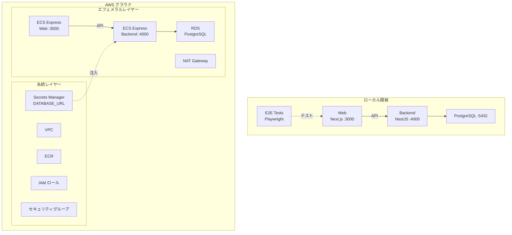

# Step 4 — ECS Express Mode 上の Next.js + NestJS（Items CRUD）

Next.js フロントエンドと、ヘルスチェック（Git SHA）および Items CRUD（PostgreSQL + Prisma）を備えた NestJS バックエンドを、Amazon ECS Express Mode にデプロイします。

## サービス

| サービス | 技術 | ポート |
|---------|------|--------|
| backend | NestJS 11 + PostgreSQL 17 + Prisma | 4000 |
| web | Next.js 16 | 3000 |

## 開始時のアーキテクチャ

以下の図は、このステップを**開始した時点で既にあるもの**を示しています — 最終目標ではありません。完了後に何が構築されるかは[完了後の期待される出力](#完了後の期待される出力)を参照してください。



## プロジェクト構成

```
.
├── compose.yaml
├── backend/               # NestJS API（ヘルスチェック + Items CRUD）
│   └── prisma/            # Prisma スキーマ（Item モデル）
├── web/
│   ├── app/               # Next.js App Router
│   └── e2e-tests/         # Playwright E2E テスト
├── iac/                   # Terraform IaC（AWS）
├── Dockerfiles.d/
├── .github/               # GitHub Actions ワークフロー + カスタムアクション
└── docs/
```

## 前提条件

- Docker Engine + Docker Compose（例: [Docker Desktop](https://www.docker.com/products/docker-desktop/)、[Podman](https://podman.io/)、[Colima](https://github.com/abiosoft/colima)）
- 管理者権限を持つ AWS アカウント（オプション — クラウドにデプロイする場合のみ必要）
- GitHub リポジトリ（オプション — `.github/` の GitHub Actions CI/CD ワークフローを使用する場合のみ必要）

## このステップを実行する

```sh
cp .example.env .env               # 必要に応じて編集 — ファイル内のコメントを参照
cp .example.secrets.env .secrets.env
docker compose up
```

> **セキュリティに関する注意:** 本ワークショップでは学習しやすさのためにシークレットを `.secrets.env` ファイルに配置しています。本番環境ではローカルファイルではなくシークレットマネージャー（例：AWS Secrets Manager）を使用してください。AI コーディングエージェントは作業ディレクトリ内のファイルを読み取れるため、`.secrets.env` に本番用の認証情報を絶対に入れないでください。サンプルのデフォルト値はローカル開発用で安全です。`.secrets.env` は `.gitignore` の `*.env` により Git から除外されています。

| URL | 説明 |
|-----|------|
| http://localhost:4000/health | バックエンドヘルスチェック |
| http://localhost:4000/api | Swagger UI |
| http://localhost:3000 | Web |

## E2E テストの実行

```sh
docker compose --profile=e2e-tests run --rm web-e2e-tests
```

## クラウドデプロイ（Terraform）

ECS ワークショップですので、フル体験のために **AWS へのデプロイを推奨します**。Terraform コマンドはすべて `docker compose` 経由で実行するため、ホストに Terraform をインストールする必要はありません。AWS アカウントをまだお持ちでない場合は、ローカル開発で先に進めて後からデプロイすることもできます。

> **コストに関する注意:** ECS および関連リソースは稼働中に時間単位で課金されます。作業が終わったら、予期しないコストを避けるためにエフェメラルレイヤーを破棄してください：
> ```sh
> docker compose --profile=iac run --rm iac terraform -chdir=aws/ephemeral destroy -var-file=terraform.tfvars
> ```
> `terraform apply` でいつでも再作成できます。コスト見積もりはトップレベルの [README](../README.ja.md#所要時間--コスト見積もり) を参照してください。

詳細は [docs/cloud-deployment-aws.md](docs/cloud-deployment-aws.md) を参照してください。概要：

```sh
# 1. 変数の設定
cp iac/aws/terraform.tfvars.example iac/aws/terraform.tfvars
cp iac/aws/ephemeral/terraform.tfvars.example iac/aws/ephemeral/terraform.tfvars
# terraform.tfvars を編集し、app_unique_id を設定（例: "my-workshop"）
# APP_UNIQUE_ID は AWS リソース名（ECR リポジトリ、Secrets Manager キーなど）の一意なプレフィックスです

# 2. 永続インフラのデプロイ（VPC、ECR、IAM、Secrets Manager）
source .env
docker compose --profile=iac run --rm iac terraform -chdir=aws init \
  -backend-config="bucket=$AWS_TF_STATE_BUCKET" \
  -backend-config="region=$AWS_TF_STATE_REGION"
docker compose --profile=iac run --rm iac terraform -chdir=aws apply -var-file=terraform.tfvars

# 3. Docker イメージをビルドして ECR にプッシュ
aws ecr get-login-password --region $AWS_REGION | \
  docker login --username AWS --password-stdin $ACCOUNT_ID.dkr.ecr.$AWS_REGION.amazonaws.com
docker build -f Dockerfiles.d/backend-build/Dockerfile \
  -t $ACCOUNT_ID.dkr.ecr.$AWS_REGION.amazonaws.com/${APP_UNIQUE_ID}-backend:latest \
  backend
docker push $ACCOUNT_ID.dkr.ecr.$AWS_REGION.amazonaws.com/${APP_UNIQUE_ID}-backend:latest
docker build -f Dockerfiles.d/web-build/Dockerfile \
  -t $ACCOUNT_ID.dkr.ecr.$AWS_REGION.amazonaws.com/${APP_UNIQUE_ID}-web:latest \
  web/app
docker push $ACCOUNT_ID.dkr.ecr.$AWS_REGION.amazonaws.com/${APP_UNIQUE_ID}-web:latest

# 4. エフェメラルインフラをデプロイ（ECS Express Gateway、RDS）
docker compose --profile=iac run --rm iac terraform -chdir=aws/ephemeral init \
  -backend-config="bucket=$AWS_TF_STATE_BUCKET" \
  -backend-config="region=$AWS_TF_STATE_REGION"
docker compose --profile=iac run --rm iac terraform -chdir=aws/ephemeral apply -var-file=terraform.tfvars
```

### シークレット

プロンプト実行前は、唯一のシークレットである `DATABASE_URL` はエフェメラルレイヤーの Terraform が RDS エンドポイントから**自動的に設定**します。

プロンプト実行後、AI エージェントが `AUTH_JWT_SECRET` と `AUTH_JWT_REFRESH_SECRET` を Secrets Manager に追加します。手動で値を設定する必要があります：

```sh
aws secretsmanager put-secret-value \
  --secret-id "${APP_UNIQUE_ID}/backend/AUTH_JWT_SECRET" \
  --secret-string "$(openssl rand -base64 32)"
aws secretsmanager put-secret-value \
  --secret-id "${APP_UNIQUE_ID}/backend/AUTH_JWT_REFRESH_SECRET" \
  --secret-string "$(openssl rand -base64 32)"
```

## AI エージェントによる実装

次のステップ（step-5）に進むために、AI エージェント（[Claude Code](https://claude.ai/claude-code)、[Cursor](https://www.cursor.com/)、[GitHub Copilot](https://github.com/features/copilot)、[ChatGPT](https://chatgpt.com/) など）にコードを生成させることができます。

このディレクトリの [prompts.ja.md](prompts.ja.md) の内容をコピーして AI エージェントに渡してください。正しく実行されれば、手動の作業なしで step-5 と同等の環境が構築されます。

<details>
<summary><strong>用語解説：シークレット管理と AWS Secrets Manager（クリックで展開）</strong></summary>

**シークレット管理とは？**

シークレット管理とは、データベースパスワード、API キー、JWT 署名キーなどの機密情報を、アプリケーションコードや設定ファイルの外部で安全に保管・アクセス・ローテーションする手法です。シークレットをソースコードや環境ファイルにハードコードするのはリスクがあります。バージョン管理に誤ってコミットされたり、ログに漏洩したり、CI/CD の成果物を通じて露出する可能性があるためです。シークレット管理システムは、暗号化された一元的なストアを提供し、シークレットを保存時に暗号化し、実行時にアプリケーションに配信することでこの問題を解決します。

**なぜ AWS Secrets Manager を使うのか？**

[AWS Secrets Manager](https://aws.amazon.com/secrets-manager/) は、シークレットを保存時に暗号化し、IAM ポリシーでアクセスを制御し、ECS などの AWS サービスと直接統合するマネージドサービスです。本ワークショップでは、ECS タスクが起動時に Secrets Manager からシークレットを取得します。コンテナはタスク定義や環境ファイルに平文のシークレットを持ちません。これにより、アプリケーションコードを再デプロイすることなく、一箇所でシークレットをローテーションできます。

</details>

<details>
<summary><strong>用語解説：JWT（クリックで展開）</strong></summary>

**JWT とは？**

JWT（JSON Web Token）は、認証に使用されるコンパクトで URL セーフなトークン形式です。ユーザーがサインインすると、サーバーはユーザーの識別情報（ユーザー ID やメールなど）を含む署名付きトークンを作成します。クライアントはこのトークンを保存し、各リクエストの `Authorization: Bearer <token>` ヘッダーに含めて送信します。サーバーはデータベースでセッションを検索することなく署名を検証できるため、ステートレスでスケーラブルです。本ワークショップでは、**アクセストークン**（短期間有効、API リクエスト用）と**リフレッシュトークン**（長期間有効、新しいアクセストークンの取得用）の 2 つの JWT を使用します。

</details>

## 完了後の期待される出力

プロンプトを完了すると、step-5 と同等のプロジェクトが構築されます：

- **http://localhost:3000** — 未認証は `/signin`、認証済みは `/dashboard` にリダイレクト
- **http://localhost:3000/signup** — 登録フォーム（メール + パスワード、8 文字以上）
- **http://localhost:3000/signin** — メール/パスワードのサインインフォーム
- **http://localhost:3000/dashboard** — ユーザープロフィール表示（ID、メール、登録日）
- **http://localhost:3000/items** — ユーザースコープのアイテム（認証必須）
- **http://localhost:4000/api** — Swagger UI（Auth + Items エンドポイント）
- アイテムは認証ユーザーにスコープ（削除時に所有権チェック）
- E2E テストでサインアップフローと認証済みアイテム管理を検証

AWS にデプロイした場合は、Amazon ECS からも同じアプリケーションにアクセスできます。以下のコマンドで URL を取得してください：

```sh
docker compose --profile=iac run --rm iac terraform -chdir=aws/ephemeral output web_url
```

出力された URL をブラウザで開いて動作を確認してください。

**次のステップに進む前のクリーンアップ：**

```bash
docker compose down --remove-orphans
```

> このステップはデータベースボリュームを使用します。データベースをリセットしたい場合は、代わりに `docker compose down --remove-orphans -v` を使用してください。

<details>
<summary><strong>ワークショップを中断しますか？クラウドインフラも破棄してください（クリックで展開）</strong></summary>

AWS にデプロイした場合は、継続的な課金を避けるためにクラウドリソースを破棄してください：

```sh
# 1. エフェメラルレイヤーを破棄（ECS、RDS など）
source .env
docker compose --profile=iac run --rm iac terraform -chdir=aws/ephemeral destroy -var-file=terraform.tfvars

# 2. 永続レイヤーを破棄（VPC、ECR、IAM、Secrets Manager）
docker compose --profile=iac run --rm iac terraform -chdir=aws destroy -var-file=terraform.tfvars
```

</details>

---

[前へ: step-3 — Next.js + NestJS（ヘルスチェック）](../step-3/README.ja.md) | [次へ: step-5 — Next.js + NestJS（認証 + Items CRUD）](../step-5/README.ja.md)
