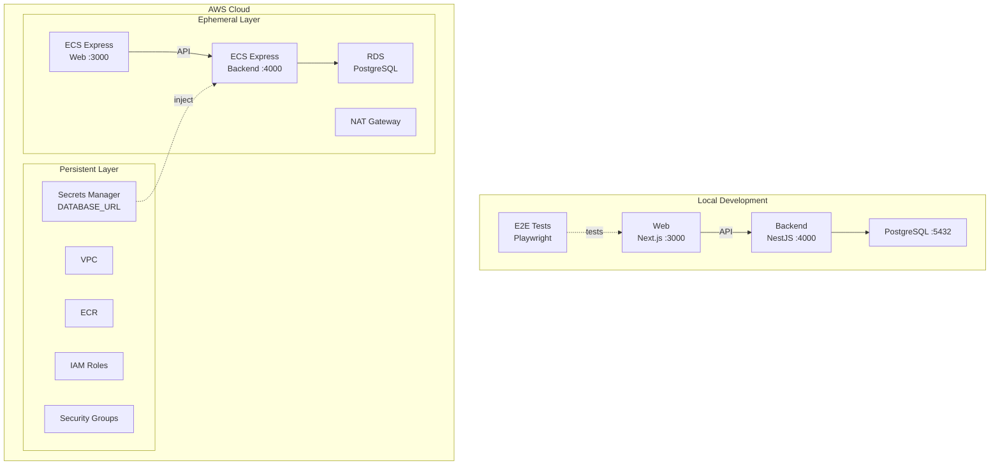

# Step 4 — Next.js + NestJS with Items CRUD on ECS Express Mode

Next.js frontend and a NestJS backend with health check (Git SHA) and Items CRUD (PostgreSQL + Prisma), deployed to Amazon ECS Express Mode.

## Services

| Service | Technology | Port |
|---------|-----------|------|
| backend | NestJS 11 + PostgreSQL 17 + Prisma | 4000 |
| web | Next.js 16 | 3000 |

## Architecture at Start

The following diagram shows what you **already have** when you begin this step — not the final goal. See [Expected Output After Completion](#expected-output-after-completion) for what you will build.



## Prerequisites

- Docker Engine + Docker Compose (e.g. [Docker Desktop](https://www.docker.com/products/docker-desktop/), [Podman](https://podman.io/), [Colima](https://github.com/abiosoft/colima))
- A GitHub repository (optional — needed only if you want to use the GitHub Actions CI/CD workflows in `.github/`)

## Run This Step

```sh
cp .example.env .env               # Edit if needed — see comments inside
cp .example.secrets.env .secrets.env
docker compose up
```

| URL | Description |
|-----|-------------|
| http://localhost:4000/health | Backend health check |
| http://localhost:4000/api | Swagger UI |
| http://localhost:3000 | Web |

## Run E2E Tests

```sh
docker compose --profile=e2e-tests run --rm web-e2e-tests
```

## Project Structure

```
.
├── compose.yaml
├── backend/               # NestJS API (health check + items CRUD)
│   └── prisma/            # Prisma schema (Item model)
├── web/
│   ├── app/               # Next.js App Router
│   └── e2e-tests/         # Playwright E2E tests
├── iac/                   # Terraform IaC (AWS)
├── Dockerfiles.d/
├── .github/               # GitHub Actions workflows + custom actions
└── docs/
```

## Cloud Deployment (Terraform)

See [docs/cloud-deployment-aws.md](docs/cloud-deployment-aws.md) for full details. Quick summary:

```sh
# 1. Configure variables
cp iac/aws/terraform.tfvars.example iac/aws/terraform.tfvars
cp iac/aws/ephemeral/terraform.tfvars.example iac/aws/ephemeral/terraform.tfvars

# 2. Deploy persistent infrastructure (VPC, ECR, IAM, Secrets Manager)
source .env
docker compose --profile=iac run --rm iac terraform -chdir=aws init \
  -backend-config="bucket=$AWS_TF_STATE_BUCKET" \
  -backend-config="region=$AWS_TF_STATE_REGION"
docker compose --profile=iac run --rm iac terraform -chdir=aws apply -var-file=terraform.tfvars

# 3. Build and push Docker images to ECR
aws ecr get-login-password --region $AWS_REGION | \
  docker login --username AWS --password-stdin $ACCOUNT_ID.dkr.ecr.$AWS_REGION.amazonaws.com
docker build -f Dockerfiles.d/backend-build/Dockerfile \
  -t $ACCOUNT_ID.dkr.ecr.$AWS_REGION.amazonaws.com/${APP_UNIQUE_ID}-backend:latest \
  backend
docker push $ACCOUNT_ID.dkr.ecr.$AWS_REGION.amazonaws.com/${APP_UNIQUE_ID}-backend:latest
docker build -f Dockerfiles.d/web-build/Dockerfile \
  -t $ACCOUNT_ID.dkr.ecr.$AWS_REGION.amazonaws.com/${APP_UNIQUE_ID}-web:latest \
  web/app
docker push $ACCOUNT_ID.dkr.ecr.$AWS_REGION.amazonaws.com/${APP_UNIQUE_ID}-web:latest

# 4. Deploy ephemeral infrastructure (ECS Express Gateway, RDS)
docker compose --profile=iac run --rm iac terraform -chdir=aws/ephemeral init \
  -backend-config="bucket=$AWS_TF_STATE_BUCKET" \
  -backend-config="region=$AWS_TF_STATE_REGION"
docker compose --profile=iac run --rm iac terraform -chdir=aws/ephemeral apply -var-file=terraform.tfvars
```

### Secrets

Before running the prompts, the only secret is `DATABASE_URL`, which is **automatically populated** by the ephemeral layer Terraform from the RDS endpoint.

After completing the prompts, the AI agent will add `AUTH_JWT_SECRET` and `AUTH_JWT_REFRESH_SECRET` to Secrets Manager. You must populate them manually:

```sh
aws secretsmanager put-secret-value \
  --secret-id "${APP_UNIQUE_ID}/backend/AUTH_JWT_SECRET" \
  --secret-string "$(openssl rand -base64 32)"
aws secretsmanager put-secret-value \
  --secret-id "${APP_UNIQUE_ID}/backend/AUTH_JWT_REFRESH_SECRET" \
  --secret-string "$(openssl rand -base64 32)"
```

## Implementation via AI Agent

To prepare for the next step (step-5), you can have an AI agent (such as [Claude Code](https://claude.ai/claude-code), [Cursor](https://www.cursor.com/), [GitHub Copilot](https://github.com/features/copilot), or [ChatGPT](https://chatgpt.com/)) generate the code for you.

Copy the contents of [prompts.md](prompts.md) in this directory and provide them to your AI agent. If executed correctly, you will have an environment equivalent to step-5 without manual intervention.

<details>
<summary><strong>Glossary: Secrets Management & AWS Secrets Manager (Click to expand)</strong></summary>

**What is secrets management?**

Secrets management is the practice of securely storing, accessing, and rotating sensitive values — such as database passwords, API keys, and JWT signing keys — outside of your application code and configuration files. Hardcoding secrets in source code or environment files is risky: they can be accidentally committed to version control, leaked in logs, or exposed through CI/CD artifacts. A secrets management system solves this by providing a centralized, encrypted store where secrets are kept at rest and delivered to applications at runtime.

**Why use AWS Secrets Manager?**

[AWS Secrets Manager](https://aws.amazon.com/secrets-manager/) is a managed service that encrypts secrets at rest, controls access via IAM policies, and integrates directly with AWS services like ECS. In this workshop, ECS tasks retrieve secrets from Secrets Manager at startup — the container never sees plaintext secrets in its task definition or environment files. This means you can rotate a secret in one place without redeploying your application code.

</details>

<details>
<summary><strong>Glossary: JWT (Click to expand)</strong></summary>

**What is JWT?**

JWT (JSON Web Token) is a compact, URL-safe token format used for authentication. When a user signs in, the server creates a signed token containing the user's identity (e.g., user ID and email). The client stores this token and sends it with each request in the `Authorization: Bearer <token>` header. The server verifies the signature without needing to look up a session in the database, making it stateless and scalable. In this workshop, we use two JWTs: an **access token** (short-lived, for API requests) and a **refresh token** (longer-lived, for obtaining new access tokens).

</details>

## Expected Output After Completion

After completing the prompts, you should have a project equivalent to step-5 with:

- **http://localhost:3000** — Redirects to `/signin` (unauthenticated) or `/dashboard` (authenticated)
- **http://localhost:3000/signup** — Registration form (email + password, 8+ characters)
- **http://localhost:3000/signin** — Sign-in form with email/password
- **http://localhost:3000/dashboard** — User profile showing ID, email, and join date
- **http://localhost:3000/items** — User-scoped items (requires authentication)
- **http://localhost:4000/api** — Swagger UI with Auth + Items endpoints
- Items are now scoped to the authenticated user (ownership check on delete)
- E2E tests verify sign-up flow and authenticated items management

**Cleanup before moving to the next step:**

```bash
docker compose down --remove-orphans
```

> This step uses a database volume. If you want to reset the database, use `docker compose down --remove-orphans -v` instead.

---

[Prev: step-3 — Next.js + NestJS (health check)](../step-3/README.md) | [Next: step-5 — Next.js + NestJS with Auth + Items CRUD](../step-5/README.md)
