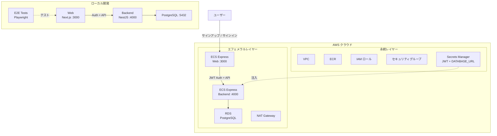

# Step 5 — ECS Express Mode 上の Next.js + NestJS（認証 + Items CRUD）

Next.js フロントエンドと、メール/パスワード認証（JWT）およびユーザースコープの Items CRUD（PostgreSQL + Prisma）を備えた NestJS バックエンドを、AWS ECS Express Mode にデプロイします。

## サービス

| サービス | 技術 | ポート |
|---------|------|--------|
| backend | NestJS 11 + PostgreSQL 17 + Prisma + JWT Auth | 4000 |
| web | Next.js 16 | 3000 |

## 開始時のアーキテクチャ

以下の図は、このステップを**開始した時点で既にあるもの**を示しています — 最終目標ではありません。完了後に何が構築されるかは[完了後の期待される出力](#完了後の期待される出力)を参照してください。



## 前提条件

- Docker Engine + Docker Compose（例: [Docker Desktop](https://www.docker.com/products/docker-desktop/)、[Podman](https://podman.io/)、[Colima](https://github.com/abiosoft/colima)）
- GitHub リポジトリ（オプション — `.github/` の GitHub Actions CI/CD ワークフローを使用する場合のみ必要）

## クイックスタート

```sh
cp .example.secrets.env .secrets.env
docker compose up
```

| URL | 説明 |
|-----|------|
| http://localhost:4000/health | バックエンドヘルスチェック |
| http://localhost:4000/api | Swagger UI |
| http://localhost:3000 | Web |

## バックエンド API

- `POST /auth/signup` — メール/パスワードで登録（JWT トークンを返す）
- `POST /auth/signin` — メール/パスワードでサインイン
- `POST /auth/refresh` — アクセストークンのリフレッシュ
- `GET /auth/me` — 現在のユーザーを取得（JWT 必須）
- `DELETE /auth/account` — アカウント削除（JWT 必須）
- `POST /items` — アイテム作成（JWT 必須）
- `GET /items` — ユーザーのアイテム一覧（JWT 必須）
- `DELETE /items/:id` — アイテム削除（JWT 必須、所有権チェック）

## プロジェクト構成

```
.
├── compose.yaml
├── backend/               # NestJS API（認証 + アイテム）
│   └── prisma/            # Prisma スキーマ（User + Item モデル）
├── web/
│   ├── app/               # Next.js App Router
│   └── e2e-tests/         # Playwright E2E テスト
├── iac/                   # Terraform IaC（AWS）
├── Dockerfiles.d/
├── .github/               # GitHub Actions ワークフロー + カスタムアクション
└── docs/
```

## クラウドデプロイ（Terraform）

詳細は [docs/cloud-deployment-aws.md](docs/cloud-deployment-aws.md) を参照してください。概要：

```sh
# 1. 変数の設定
cp iac/aws/terraform.tfvars.example iac/aws/terraform.tfvars
cp iac/aws/ephemeral/terraform.tfvars.example iac/aws/ephemeral/terraform.tfvars

# 2. 永続インフラのデプロイ（VPC、ECR、IAM、Secrets Manager）
source .env
docker compose --profile=iac run --rm iac terraform -chdir=aws init \
  -backend-config="bucket=$AWS_TF_STATE_BUCKET" \
  -backend-config="region=$AWS_TF_STATE_REGION"
docker compose --profile=iac run --rm iac terraform -chdir=aws apply -var-file=terraform.tfvars

# 3. Docker イメージをビルドして ECR にプッシュ後、エフェメラルインフラをデプロイ（ECS Express Gateway、RDS）
docker compose --profile=iac run --rm iac terraform -chdir=aws/ephemeral init \
  -backend-config="bucket=$AWS_TF_STATE_BUCKET" \
  -backend-config="region=$AWS_TF_STATE_REGION"
docker compose --profile=iac run --rm iac terraform -chdir=aws/ephemeral apply -var-file=terraform.tfvars
```

### イメージのビルドとプッシュ

永続レイヤーのデプロイ後、エフェメラルレイヤーのデプロイ前に本番イメージをビルドしてプッシュします：

```sh
# Docker を ECR に認証
aws ecr get-login-password --region $AWS_REGION | \
  docker login --username AWS --password-stdin $ACCOUNT_ID.dkr.ecr.$AWS_REGION.amazonaws.com

# Backend をビルドしてプッシュ
docker build -f Dockerfiles.d/backend/Dockerfile \
  -t $ACCOUNT_ID.dkr.ecr.$AWS_REGION.amazonaws.com/${APP_UNIQUE_ID}-backend:latest \
  backend
docker push $ACCOUNT_ID.dkr.ecr.$AWS_REGION.amazonaws.com/${APP_UNIQUE_ID}-backend:latest

# Web をビルドしてプッシュ
docker build -f Dockerfiles.d/web-build/Dockerfile \
  -t $ACCOUNT_ID.dkr.ecr.$AWS_REGION.amazonaws.com/${APP_UNIQUE_ID}-web:latest \
  web/app
docker push $ACCOUNT_ID.dkr.ecr.$AWS_REGION.amazonaws.com/${APP_UNIQUE_ID}-web:latest
```

### シークレットの設定

永続レイヤーのデプロイ後、Terraform は AWS Secrets Manager にシークレットコンテナを作成します。`DATABASE_URL` はエフェメラルレイヤーが自動的に設定しますが、JWT シークレットは手動で設定する必要があります：

```sh
aws secretsmanager put-secret-value \
  --secret-id "${APP_UNIQUE_ID}/backend/AUTH_JWT_SECRET" \
  --secret-string "$(openssl rand -base64 32)"
aws secretsmanager put-secret-value \
  --secret-id "${APP_UNIQUE_ID}/backend/AUTH_JWT_REFRESH_SECRET" \
  --secret-string "$(openssl rand -base64 32)"
```

> `APP_UNIQUE_ID` は `terraform.tfvars` の `app_unique_id` の値です。

## AI エージェントによる実装

次のステップ（step-final）に進むために、AI エージェント（[Claude Code](https://claude.ai/claude-code)、[Cursor](https://www.cursor.com/)、[GitHub Copilot](https://github.com/features/copilot)、[ChatGPT](https://chatgpt.com/) など）にコードを生成させることができます。

このディレクトリの [prompts.md](prompts.md) の内容をコピーして AI エージェントに渡してください。正しく実行されれば、手動の作業なしで step-final と同等の環境が構築されます。

## 完了後の期待される出力

プロンプトを完了すると、step-final と同等のプロジェクトが構築されます：

- **http://localhost:3000/signin** — サインインフォーム：
  - メール/パスワードフィールド
  - OAuth2 ボタン（Apple、Discord、GitHub、Google、X）
  - 「パスワードを忘れた場合」リンクと言語切り替え
  - TOTP MFA チャレンジ（ユーザーが有効にしている場合）
- **http://localhost:3000/signup** — メール認証フロー付き登録
- **http://localhost:3000/settings** — ユーザー設定：
  - メール管理（変更、認証、再送信）
  - パスワードリセット
  - TOTP MFA 設定/無効化（QR コードとリカバリーコード）
  - OAuth プロバイダーのリンク/リンク解除
  - テーマ切り替え（システム / ライト / ダーク）
  - アカウント削除
- **http://localhost:8025** — Mailpit UI（ローカルメールテスト）
- 国際化（英語 + 日本語）
- Auth、Items、TOTP、テーマの完全な E2E テストスイート

---

[前へ: step-4 — Next.js + NestJS（Items CRUD）](../step-4/README.ja.md) | [次へ: step-final — フルスタックアプリ](../step-final/README.ja.md)
