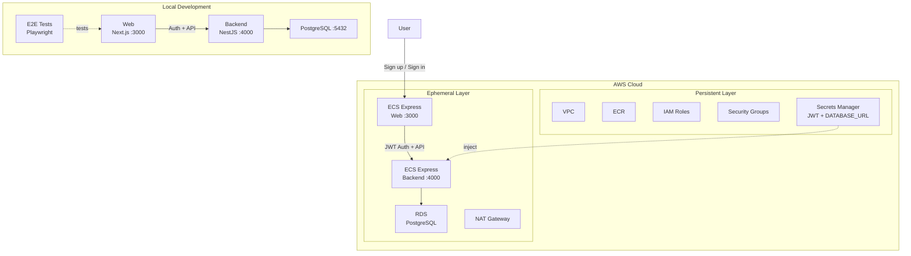

# Step 5 — Next.js + NestJS with Auth + Items CRUD on ECS Express Mode

Next.js frontend and a NestJS backend with email/password authentication (JWT), user-scoped Items CRUD (PostgreSQL + Prisma), deployed to Amazon ECS Express Mode.

## Services

| Service | Technology | Port |
|---------|-----------|------|
| backend | NestJS 11 + PostgreSQL 17 + Prisma + JWT Auth | 4000 |
| web | Next.js 16 | 3000 |

## Architecture at Start

The following diagram shows what you **already have** when you begin this step — not the final goal. See [Expected Output After Completion](#expected-output-after-completion) for what you will build.



## Prerequisites

- Docker Engine + Docker Compose (e.g. [Docker Desktop](https://www.docker.com/products/docker-desktop/), [Podman](https://podman.io/), [Colima](https://github.com/abiosoft/colima))
- A GitHub repository (optional — needed only if you want to use the GitHub Actions CI/CD workflows in `.github/`)

## Quick Start

```sh
cp .example.secrets.env .secrets.env
docker compose up
```

| URL | Description |
|-----|-------------|
| http://localhost:4000/health | Backend health check |
| http://localhost:4000/api | Swagger UI |
| http://localhost:3000 | Web |

## Backend API

- `POST /auth/signup` — Register with email/password (returns JWT tokens)
- `POST /auth/signin` — Sign in with email/password
- `POST /auth/refresh` — Refresh access token
- `GET /auth/me` — Get current user (requires JWT)
- `DELETE /auth/account` — Delete account (requires JWT)
- `POST /items` — Create item (requires JWT)
- `GET /items` — List user's items (requires JWT)
- `DELETE /items/:id` — Delete item (requires JWT, ownership check)

## Project Structure

```
.
├── compose.yaml
├── backend/               # NestJS API (auth + items)
│   └── prisma/            # Prisma schema (User + Item models)
├── web/
│   ├── app/               # Next.js App Router
│   └── e2e-tests/         # Playwright E2E tests
├── iac/                   # Terraform IaC (AWS)
├── Dockerfiles.d/
├── .github/               # GitHub Actions workflows + custom actions
└── docs/
```

## Cloud Deployment (Terraform)

See [docs/cloud-deployment-aws.md](docs/cloud-deployment-aws.md) for full details. Quick summary:

```sh
# 1. Configure variables
cp iac/aws/terraform.tfvars.example iac/aws/terraform.tfvars
cp iac/aws/ephemeral/terraform.tfvars.example iac/aws/ephemeral/terraform.tfvars

# 2. Deploy persistent infrastructure (VPC, ECR, IAM, Secrets Manager)
source .env
docker compose --profile=iac run --rm iac terraform -chdir=aws init \
  -backend-config="bucket=$AWS_TF_STATE_BUCKET" \
  -backend-config="region=$AWS_TF_STATE_REGION"
docker compose --profile=iac run --rm iac terraform -chdir=aws apply -var-file=terraform.tfvars

# 3. Build and push Docker images to ECR
aws ecr get-login-password --region $AWS_REGION | \
  docker login --username AWS --password-stdin $ACCOUNT_ID.dkr.ecr.$AWS_REGION.amazonaws.com
docker build -f Dockerfiles.d/backend-build/Dockerfile \
  -t $ACCOUNT_ID.dkr.ecr.$AWS_REGION.amazonaws.com/${APP_UNIQUE_ID}-backend:latest \
  backend
docker push $ACCOUNT_ID.dkr.ecr.$AWS_REGION.amazonaws.com/${APP_UNIQUE_ID}-backend:latest
docker build -f Dockerfiles.d/web-build/Dockerfile \
  -t $ACCOUNT_ID.dkr.ecr.$AWS_REGION.amazonaws.com/${APP_UNIQUE_ID}-web:latest \
  web/app
docker push $ACCOUNT_ID.dkr.ecr.$AWS_REGION.amazonaws.com/${APP_UNIQUE_ID}-web:latest

# 4. Deploy ephemeral infrastructure (ECS Express Gateway, RDS)
docker compose --profile=iac run --rm iac terraform -chdir=aws/ephemeral init \
  -backend-config="bucket=$AWS_TF_STATE_BUCKET" \
  -backend-config="region=$AWS_TF_STATE_REGION"
docker compose --profile=iac run --rm iac terraform -chdir=aws/ephemeral apply -var-file=terraform.tfvars
```

### Populate Secrets

After deploying the persistent layer, Terraform creates secret containers in AWS Secrets Manager. `DATABASE_URL` is automatically populated by the ephemeral layer, but you must manually set the JWT secrets:

```sh
aws secretsmanager put-secret-value \
  --secret-id "${APP_UNIQUE_ID}/backend/AUTH_JWT_SECRET" \
  --secret-string "$(openssl rand -base64 32)"
aws secretsmanager put-secret-value \
  --secret-id "${APP_UNIQUE_ID}/backend/AUTH_JWT_REFRESH_SECRET" \
  --secret-string "$(openssl rand -base64 32)"
```

> `APP_UNIQUE_ID` is the value of `app_unique_id` in your `terraform.tfvars`.

## Implementation via AI Agent

To prepare for the next step (step-final), you can have an AI agent (such as [Claude Code](https://claude.ai/claude-code), [Cursor](https://www.cursor.com/), [GitHub Copilot](https://github.com/features/copilot), or [ChatGPT](https://chatgpt.com/)) generate the code for you.

Copy the contents of [prompts.md](prompts.md) in this directory and provide them to your AI agent. If executed correctly, you will have an environment equivalent to step-final without manual intervention.

> **Note:** The prompts will add email sending functionality. For local development, Mailpit is used as a mock SMTP server (no configuration needed). A real SMTP service is **optional** — this workshop sets `AUTH_REQUIRE_EMAIL_VERIFICATION=false` by default, so email verification is bypassed. If you want to enable email verification for cloud deployment, you can use a service such as [Amazon SES](https://aws.amazon.com/ses/), [SendGrid](https://sendgrid.com/), or [Mailgun](https://www.mailgun.com/).

<details>
<summary><strong>Glossary: OAuth2, MFA / TOTP (Click to expand)</strong></summary>

**What is OAuth2?**

OAuth2 is an authorization protocol that lets users sign in to your application using their existing accounts on other services (Google, GitHub, Apple, etc.) instead of creating a new password. When a user clicks "Sign in with Google," they are redirected to Google to authenticate, then sent back to your app with a token proving their identity. This is both more convenient for users and more secure since your app never handles their password.

**What is MFA / TOTP?**

MFA (Multi-Factor Authentication) adds a second layer of security beyond just a password. TOTP (Time-based One-Time Password) is one of the most common MFA methods — the user scans a QR code with an authenticator app (e.g., Google Authenticator, Authy), which then generates a 6-digit code that changes every 30 seconds. At sign-in, the user enters both their password and the current code, making it much harder for an attacker to gain access even if the password is compromised.

</details>

## Expected Output After Completion

After completing the prompts, you should have a project equivalent to step-final with:

- **http://localhost:3000/signin** — Sign-in form with:
  - Email/password fields
  - OAuth2 buttons (Apple, Discord, GitHub, Google, X)
  - "Forgot password?" link and language switcher
  - TOTP MFA challenge (if enabled for the user)
- **http://localhost:3000/signup** — Registration with email verification flow
- **http://localhost:3000/settings** — User settings:
  - Email management (change, verify, resend)
  - Password reset
  - TOTP MFA setup/disable with QR code and recovery codes
  - OAuth provider linking/unlinking
  - Theme toggle (System / Light / Dark)
  - Account deletion
- **http://localhost:8025** — Mailpit UI for local email testing
- Internationalization (English + Japanese)
- Full E2E test suites for auth, items, TOTP, and theme

**Cleanup before moving to the next step:**

```bash
docker compose down --remove-orphans
```

> This step uses a database volume. If you want to reset the database, use `docker compose down --remove-orphans -v` instead.

---

[Prev: step-4 — Next.js + NestJS with Items CRUD](../step-4/README.md) | [Next: step-final — Full-Stack App](../step-final/README.md)
