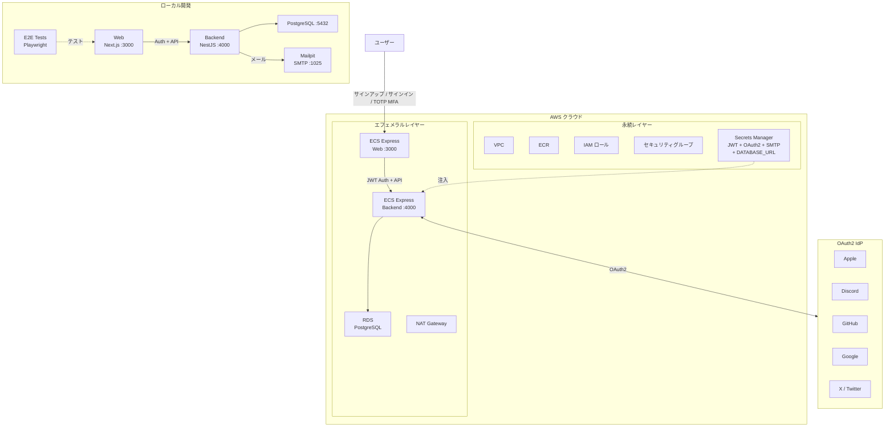

# template-containerized-oauth2-project

AI エージェントを使って Next.js、NestJS、Prisma アプリを ECS Express Mode 上で開発するためのサンプルプロジェクトです。

## サービス

| サービス | 技術 | ポート |
|---------|------|--------|
| backend | NestJS 11 + PostgreSQL 17 | 4000 |
| web | Next.js 16 | 3000 |

## アーキテクチャ



## 前提条件

- Docker Engine + Docker Compose（例: [Docker Desktop](https://www.docker.com/products/docker-desktop/)、[Podman](https://podman.io/)、[Colima](https://github.com/abiosoft/colima)）

## クイックスタート

```sh
cp .example.secrets.env .secrets.env   # シークレットを記入 — docs/local-development.md を参照
docker compose up
```

| URL | 説明 |
|-----|------|
| http://localhost:4000 | バックエンド API |
| http://localhost:4000/api | Swagger UI |
| http://localhost:3000 | Web |

詳細なセットアップ手順（OAuth プロバイダーの設定、E2E テストなど）は [Local Development](docs/local-development.md) を参照してください。

## このテンプレートの使い方

このテンプレートからリポジトリを作成した後、以下の手順に従ってください。ステップ 1 のみ必須で、残りは必要に応じて実施してください。

1. **ローカル開発** — `.example.secrets.env` を `.secrets.env` にコピーし、シークレットを記入して `docker compose up` を実行。[Local Development](docs/local-development.md) を参照。
2. **CI での E2E テスト** — JWT と OAuth2 プロバイダーの GitHub Actions シークレットを追加。[CI — E2E テストのセットアップ](docs/ci.md#for-e2e-tests-only) を参照。
3. **CI でのクラウドデプロイ** — OIDC 認証を設定し、GitHub Actions 変数を構成して IaC ワークフローを実行。[CI — クラウドデプロイのセットアップ](docs/ci.md#for-cloud-deployment-e2e-tests--production-builds--iac) を参照。
4. **手動クラウドデプロイ** — Terraform で直接デプロイ。[Cloud Deployment](docs/cloud-deployment.md) を参照。

## クラウドデプロイ（Terraform）

詳細は [docs/cloud-deployment-aws.md](docs/cloud-deployment-aws.md) を参照してください。Secrets Manager のセットアップは [docs/secrets.md](docs/secrets.md) も参照してください。

```sh
# 1. 変数の設定
cp iac/aws/terraform.tfvars.example iac/aws/terraform.tfvars
cp iac/aws/ephemeral/terraform.tfvars.example iac/aws/ephemeral/terraform.tfvars

# 2. 永続インフラのデプロイ（VPC、ECR、IAM、Secrets Manager）
source .env
docker compose --profile=iac run --rm iac terraform -chdir=aws init \
  -backend-config="bucket=$AWS_TF_STATE_BUCKET" \
  -backend-config="region=$AWS_TF_STATE_REGION"
docker compose --profile=iac run --rm iac terraform -chdir=aws apply -var-file=terraform.tfvars

# 3. Docker イメージをビルドして ECR にプッシュ後、エフェメラルインフラをデプロイ（ECS Express Gateway、RDS）
docker compose --profile=iac run --rm iac terraform -chdir=aws/ephemeral init \
  -backend-config="bucket=$AWS_TF_STATE_BUCKET" \
  -backend-config="region=$AWS_TF_STATE_REGION"
docker compose --profile=iac run --rm iac terraform -chdir=aws/ephemeral apply -var-file=terraform.tfvars
```

## プロジェクト構成

```
.
├── compose.yaml
├── .example.secrets.env
├── backend/               # NestJS API
├── web/
│   ├── app/               # Next.js SPA
│   └── e2e-tests/         # Playwright E2E テスト
├── iac/                   # Terraform IaC（AWS）
├── Dockerfiles.d/
├── .github/               # GitHub Actions ワークフロー + カスタムアクション
└── docs/
```

## ドキュメント

- [Local Development](docs/local-development.md) — 環境セットアップ、スタックの実行、E2E テスト
- クラウドデプロイ — [概要](docs/cloud-deployment.md) / [AWS](docs/cloud-deployment-aws.md)
- [CI / GitHub Actions](docs/ci.md) — ワークフロー、必要なシークレットと変数
- [Secrets Management](docs/secrets.md) — AWS Secrets Manager
- [OIDC Setup](docs/oidc-setup.md) — クラウドプロバイダー認証の初期設定
- [Git SHA Display](docs/git-sha-display.md) — プラットフォームごとのビルド SHA 注入
- [Environment Variables](.example.secrets.env) — バックエンドの設定とシークレット
- [GitHub Actions Variables](.example.env) — CI/CD とクラウドデプロイの変数

---

[前へ: step-5 — Next.js + NestJS（認証 + Items CRUD）](../step-5/README.ja.md)
