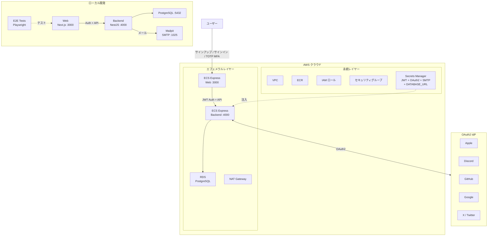

# step-final — フルスタックアプリケーション

## サービス

| サービス | 技術 | ポート |
|---------|------|--------|
| backend | NestJS 11 + PostgreSQL 17 | 4000 |
| web | Next.js 16 | 3000 |

## アーキテクチャ

以下の図は、この完成版アプリケーションのアーキテクチャを示しています。



## プロジェクト構成

```
.
├── compose.yaml
├── .example.secrets.env
├── backend/               # NestJS API
├── web/
│   ├── app/               # Next.js SPA
│   └── e2e-tests/         # Playwright E2E テスト
├── iac/                   # Terraform IaC（AWS）
├── Dockerfiles.d/
├── .github/               # GitHub Actions ワークフロー + カスタムアクション
└── docs/
```

## 前提条件

- Docker Engine + Docker Compose（例: [Docker Desktop](https://www.docker.com/products/docker-desktop/)、[Podman](https://podman.io/)、[Colima](https://github.com/abiosoft/colima)）
- 管理者権限を持つ AWS アカウント（オプション — クラウドにデプロイする場合のみ必要）
- GitHub リポジトリ（オプション — `.github/` の GitHub Actions CI/CD ワークフローを使用する場合のみ必要）

## このステップを実行する

```sh
cp .example.env .env               # 必要に応じて編集 — ファイル内のコメントを参照
cp .example.secrets.env .secrets.env   # シークレットを記入 — docs/local-development.md を参照
docker compose up
```

> **セキュリティに関する注意:** 本ワークショップでは学習しやすさのためにシークレットを `.secrets.env` ファイルに配置しています。本番環境ではローカルファイルではなくシークレットマネージャー（例：AWS Secrets Manager）を使用してください。AI コーディングエージェントは作業ディレクトリ内のファイルを読み取れるため、`.secrets.env` に本番用の認証情報を絶対に入れないでください。サンプルのデフォルト値はローカル開発用で安全です。`.secrets.env` は `.gitignore` の `*.env` により Git から除外されています。

> **ヒント:** OAuth2 プロバイダー（Apple、Discord、GitHub、Google、X）の設定は、このステップを試すだけなら不要です。`.example.secrets.env` のデフォルトのダミー値のままでアプリは動作します。OAuth2 サインインボタンは機能しませんが、メール/パスワードでのサインアップとサインインは OAuth2 の設定なしで利用できます。

| URL | 説明 |
|-----|------|
| http://localhost:4000 | バックエンド API |
| http://localhost:4000/api | Swagger UI |
| http://localhost:3000 | Web |

詳細なセットアップ手順（OAuth プロバイダーの設定、E2E テストなど）は [Local Development](docs/local-development.md) を参照してください。

## クラウドデプロイ（Terraform）

ECS ワークショップですので、フル体験のために **AWS へのデプロイを推奨します**。Terraform コマンドはすべて `docker compose` 経由で実行するため、ホストに Terraform をインストールする必要はありません。AWS アカウントをまだお持ちでない場合は、ローカル開発で先に進めて後からデプロイすることもできます。

> **コストに関する注意:** ECS および関連リソースは稼働中に時間単位で課金されます。作業が終わったら、予期しないコストを避けるためにエフェメラルレイヤーを破棄してください：
> ```sh
> docker compose --profile=iac run --rm iac terraform -chdir=aws/ephemeral destroy -var-file=terraform.tfvars
> ```
> `terraform apply` でいつでも再作成できます。コスト見積もりはトップレベルの [README](../README.ja.md#所要時間--コスト見積もり) を参照してください。

詳細は [docs/cloud-deployment-aws.md](docs/cloud-deployment-aws.md) を参照してください。Secrets Manager のセットアップは [docs/secrets.md](docs/secrets.md) も参照してください。

```sh
# 1. 変数の設定
cp iac/aws/terraform.tfvars.example iac/aws/terraform.tfvars
cp iac/aws/ephemeral/terraform.tfvars.example iac/aws/ephemeral/terraform.tfvars
# terraform.tfvars を編集し、app_unique_id を設定（例: "my-workshop"）
# APP_UNIQUE_ID は AWS リソース名（ECR リポジトリ、Secrets Manager キーなど）の一意なプレフィックスです

# 2. 永続インフラのデプロイ（VPC、ECR、IAM、Secrets Manager）
source .env
docker compose --profile=iac run --rm iac terraform -chdir=aws init \
  -backend-config="bucket=$AWS_TF_STATE_BUCKET" \
  -backend-config="region=$AWS_TF_STATE_REGION"
docker compose --profile=iac run --rm iac terraform -chdir=aws apply -var-file=terraform.tfvars

# 3. Docker イメージをビルドして ECR にプッシュ
aws ecr get-login-password --region $AWS_REGION | \
  docker login --username AWS --password-stdin $ACCOUNT_ID.dkr.ecr.$AWS_REGION.amazonaws.com
docker build -f Dockerfiles.d/backend-build/Dockerfile \
  -t $ACCOUNT_ID.dkr.ecr.$AWS_REGION.amazonaws.com/${APP_UNIQUE_ID}-backend:latest \
  backend
docker push $ACCOUNT_ID.dkr.ecr.$AWS_REGION.amazonaws.com/${APP_UNIQUE_ID}-backend:latest
docker build -f Dockerfiles.d/web-build/Dockerfile \
  -t $ACCOUNT_ID.dkr.ecr.$AWS_REGION.amazonaws.com/${APP_UNIQUE_ID}-web:latest \
  web/app
docker push $ACCOUNT_ID.dkr.ecr.$AWS_REGION.amazonaws.com/${APP_UNIQUE_ID}-web:latest

# 4. エフェメラルインフラをデプロイ（ECS Express Gateway、RDS）
docker compose --profile=iac run --rm iac terraform -chdir=aws/ephemeral init \
  -backend-config="bucket=$AWS_TF_STATE_BUCKET" \
  -backend-config="region=$AWS_TF_STATE_REGION"
docker compose --profile=iac run --rm iac terraform -chdir=aws/ephemeral apply -var-file=terraform.tfvars
```

### シークレットの設定

永続レイヤーのデプロイ後、Terraform は AWS Secrets Manager にシークレットコンテナを作成します。`DATABASE_URL` はエフェメラルレイヤーが自動的に設定しますが、残りのシークレットは AWS CLI で手動で設定する必要があります：

| シークレット | 生成方法 |
|-------------|---------|
| `AUTH_JWT_SECRET` | `openssl rand -base64 32` |
| `AUTH_JWT_REFRESH_SECRET` | `openssl rand -base64 32` |
| `AUTH_SESSION_SECRET` | `openssl rand -base64 32` |
| `AUTH_APPLE_PRIVATE_KEY` | [Apple Developer](https://developer.apple.com/) アカウントから取得 |
| `AUTH_DISCORD_CLIENT_SECRET` | [Discord Developer Portal](https://discord.com/developers/) から取得 |
| `AUTH_GITHUB_CLIENT_SECRET` | [GitHub Developer Settings](https://github.com/settings/developers) から取得 |
| `AUTH_GOOGLE_CLIENT_SECRET` | [Google Cloud Console](https://console.cloud.google.com/) から取得 |
| `AUTH_TWITTER_CLIENT_SECRET` | [Twitter Developer Portal](https://developer.x.com/) から取得 |
| `SMTP_PASS` | AWS IAM（SES SMTP 認証情報）から取得 |

```sh
# 例：シークレットを設定
aws secretsmanager put-secret-value \
  --secret-id "${APP_UNIQUE_ID}/backend/AUTH_JWT_SECRET" \
  --secret-string "$(openssl rand -base64 32)"
```

> `APP_UNIQUE_ID` は `terraform.tfvars` の `app_unique_id` の値です。

詳細な手順は [docs/secrets.md](docs/secrets.md) を参照してください。

## 期待される出力

`docker compose up` 実行後：

| URL | 説明 |
|-----|------|
| http://localhost:3000 | Web — `/signin` または `/dashboard` にリダイレクト |
| http://localhost:3000/signup | メール認証付き登録 |
| http://localhost:3000/items | 認証済み Items CRUD（ユーザースコープ） |
| http://localhost:3000/settings | メール、パスワード、TOTP MFA、OAuth リンク、テーマ |
| http://localhost:4000/api | Swagger UI（Auth、Users、Items エンドポイント） |
| http://localhost:4000/health | `{ "status": "ok", "gitSha": "..." }` |
| http://localhost:8025 | Mailpit UI（ローカルメールテスト） |

**サインインページの機能：**
- メール/パスワードフィールド
- OAuth2 ボタン（Apple、Discord、GitHub、Google、X）
- 「パスワードを忘れた場合」リンクと言語切り替え
- TOTP MFA チャレンジ（ユーザーが有効にしている場合）

**設定ページの機能：**
- メール管理（変更、認証、再送信）
- パスワードリセット
- TOTP MFA 設定/無効化（QR コードとリカバリーコード）
- OAuth プロバイダーのリンク/リンク解除
- テーマ切り替え（システム / ライト / ダーク）
- アカウント削除

AWS にデプロイした場合は、Amazon ECS からも同じアプリケーションにアクセスできます。以下のコマンドで URL を取得してください：

```sh
docker compose --profile=iac run --rm iac terraform -chdir=aws/ephemeral output web_url
```

出力された URL をブラウザで開いて動作を確認してください。

## 🎉 ワークショップ完了おめでとうございます！

Next.js、NestJS、Prisma、Amazon ECS（Express Mode）を組み合わせたモダンなフルスタック環境を、AI エージェントとの協働で構築することに成功しました。

この `step-final` ディレクトリは単なるチュートリアルの終着点ではなく、**あなた自身のアプリケーションのための、本番環境に対応した強力な出発点（テンプレート）です。**

安全な OAuth2 IdP 統合と堅牢でコスト効率の高いインフラ設計（永続レイヤーとエフェメラルレイヤー）が組み込まれており、基盤はすべて整っています。あとはこの環境を使って、あなた自身のアイデアを形にしましょう。

Happy coding、AI 駆動開発の未来を楽しんでください！ 🚀

## ドキュメント

- [Local Development](docs/local-development.md) — 環境セットアップ、スタックの実行、E2E テスト
- クラウドデプロイ — [概要](docs/cloud-deployment.md) / [AWS](docs/cloud-deployment-aws.md)
- [CI / GitHub Actions](docs/ci.md) — ワークフロー、必要なシークレットと変数
- [Secrets Management](docs/secrets.md) — AWS Secrets Manager
- [OIDC Setup](docs/oidc-setup.md) — クラウドプロバイダー認証の初期設定
- [Git SHA Display](docs/git-sha-display.md) — プラットフォームごとのビルド SHA 注入
- [Environment Variables](.example.secrets.env) — バックエンドの設定とシークレット
- [GitHub Actions Variables](.example.env) — CI/CD とクラウドデプロイの変数

**クリーンアップ：**

```bash
docker compose down --remove-orphans -v
```

<details>
<summary><strong>ワークショップ終了？クラウドインフラを破棄してください（クリックで展開）</strong></summary>

AWS にデプロイした場合は、継続的な課金を避けるためにクラウドリソースを破棄してください：

```sh
# 1. エフェメラルレイヤーを破棄（ECS、RDS など）
source .env
docker compose --profile=iac run --rm iac terraform -chdir=aws/ephemeral destroy -var-file=terraform.tfvars

# 2. 永続レイヤーを破棄（VPC、ECR、IAM、Secrets Manager）
docker compose --profile=iac run --rm iac terraform -chdir=aws destroy -var-file=terraform.tfvars
```

</details>

---

[前へ: step-5 — Next.js + NestJS（認証 + Items CRUD）](../step-5/README.ja.md)
