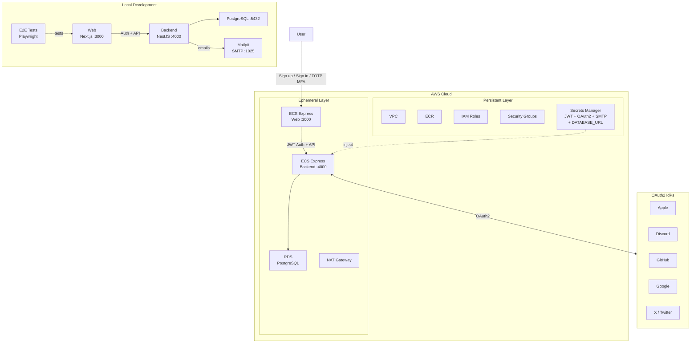

# step-final — Full-Stack Application

## Services

| Service | Technology | Port |
|---------|-----------|------|
| backend | NestJS 11 + PostgreSQL 17 | 4000 |
| web | Next.js 16 | 3000 |

## Architecture

The following diagram shows the architecture of this completed application.



## Prerequisites

- Docker Engine + Docker Compose (e.g. [Docker Desktop](https://www.docker.com/products/docker-desktop/), [Podman](https://podman.io/), [Colima](https://github.com/abiosoft/colima))
- An AWS account with administrator access (optional — needed only if you want to deploy to the cloud)
- A GitHub repository (optional — needed only if you want to use the GitHub Actions CI/CD workflows in `.github/`)

## Run This Step

```sh
cp .example.env .env               # Edit if needed — see comments inside
cp .example.secrets.env .secrets.env   # then fill in secrets — see docs/local-development.md
docker compose up
```

> **Security note:** This workshop places secrets in `.secrets.env` for simplicity. In production, use a secrets manager (e.g. AWS Secrets Manager) instead of local files. Be aware that AI coding agents can read files in your working directory — never place production credentials in `.secrets.env`. The example defaults are safe for local development. `.secrets.env` is excluded from Git via `*.env` in `.gitignore`.

| URL | Description |
|-----|-------------|
| http://localhost:4000 | backend API |
| http://localhost:4000/api | Swagger UI |
| http://localhost:3000 | Web |

See [Local Development](docs/local-development.md) for detailed setup instructions (OAuth provider configuration, E2E tests, etc.).

## Expected Output

After running `docker compose up`:

| URL | Description |
|-----|-------------|
| http://localhost:3000 | Web — redirects to `/signin` or `/dashboard` |
| http://localhost:3000/signup | Registration with email verification |
| http://localhost:3000/items | Authenticated items CRUD (user-scoped) |
| http://localhost:3000/settings | Email, password, TOTP MFA, OAuth linking, theme |
| http://localhost:4000/api | Swagger UI (Auth, Users, Items endpoints) |
| http://localhost:4000/health | `{ "status": "ok", "gitSha": "..." }` |
| http://localhost:8025 | Mailpit UI (local email testing) |

**Sign-in page features:**
- Email/password fields
- OAuth2 buttons (Apple, Discord, GitHub, Google, X)
- "Forgot password?" link and language switcher
- TOTP MFA challenge (if enabled for the user)

**Settings page features:**
- Email management (change, verify, resend)
- Password reset
- TOTP MFA setup/disable with QR code and recovery codes
- OAuth provider linking/unlinking
- Theme toggle (System / Light / Dark)
- Account deletion

## 🎉 Congratulations on completing the workshop!

You have successfully built a modern full-stack environment combining Next.js, NestJS, Prisma, and Amazon ECS (Express Mode) through collaboration with an AI agent.

This `step-final` directory is not just the end of a tutorial—it is a **powerful, production-ready starting point (template) for your own applications.**

With built-in secure OAuth2 IdP integration and a robust, cost-effective infrastructure design (Persistent vs. Ephemeral layers), the foundation is fully laid out for you. Now it's time to use this environment to bring your own ideas to life.

Happy coding, and enjoy the future of AI-driven development! 🚀

## Use This Template

After creating a repository from this template, follow these steps. Only step 1 is required — the rest are optional depending on your needs.

1. **Local development** — Copy `.example.secrets.env` → `.secrets.env`, fill in secrets, and run `docker compose up`. See [Local Development](docs/local-development.md).
2. **E2E tests on CI** — Add GitHub Actions secrets for JWT and OAuth2 providers. See [CI — Setup for E2E tests](docs/ci.md#for-e2e-tests-only).
3. **Cloud deployment via CI** — Set up OIDC authentication, configure GitHub Actions variables, and run IaC workflows. See [CI — Setup for cloud deployment](docs/ci.md#for-cloud-deployment-e2e-tests--production-builds--iac).
4. **Manual cloud deployment** — Deploy directly with Terraform. See [Cloud Deployment](docs/cloud-deployment.md).

## Cloud Deployment (Terraform)

This is an ECS workshop, so we **recommend deploying to AWS** to get the full experience. All Terraform commands run via `docker compose`, so no local Terraform installation is required. If you don't have an AWS account yet, you can still proceed with local development and deploy later.

See [docs/cloud-deployment-aws.md](docs/cloud-deployment-aws.md) for full details. See also [docs/secrets.md](docs/secrets.md) for Secrets Manager setup.

```sh
# 1. Configure variables
cp iac/aws/terraform.tfvars.example iac/aws/terraform.tfvars
cp iac/aws/ephemeral/terraform.tfvars.example iac/aws/ephemeral/terraform.tfvars

# 2. Deploy persistent infrastructure (VPC, ECR, IAM, Secrets Manager)
source .env
docker compose --profile=iac run --rm iac terraform -chdir=aws init \
  -backend-config="bucket=$AWS_TF_STATE_BUCKET" \
  -backend-config="region=$AWS_TF_STATE_REGION"
docker compose --profile=iac run --rm iac terraform -chdir=aws apply -var-file=terraform.tfvars

# 3. Build and push Docker images to ECR
aws ecr get-login-password --region $AWS_REGION | \
  docker login --username AWS --password-stdin $ACCOUNT_ID.dkr.ecr.$AWS_REGION.amazonaws.com
docker build -f Dockerfiles.d/backend-build/Dockerfile \
  -t $ACCOUNT_ID.dkr.ecr.$AWS_REGION.amazonaws.com/${APP_UNIQUE_ID}-backend:latest \
  backend
docker push $ACCOUNT_ID.dkr.ecr.$AWS_REGION.amazonaws.com/${APP_UNIQUE_ID}-backend:latest
docker build -f Dockerfiles.d/web-build/Dockerfile \
  -t $ACCOUNT_ID.dkr.ecr.$AWS_REGION.amazonaws.com/${APP_UNIQUE_ID}-web:latest \
  web/app
docker push $ACCOUNT_ID.dkr.ecr.$AWS_REGION.amazonaws.com/${APP_UNIQUE_ID}-web:latest

# 4. Deploy ephemeral infrastructure (ECS Express Gateway, RDS)
docker compose --profile=iac run --rm iac terraform -chdir=aws/ephemeral init \
  -backend-config="bucket=$AWS_TF_STATE_BUCKET" \
  -backend-config="region=$AWS_TF_STATE_REGION"
docker compose --profile=iac run --rm iac terraform -chdir=aws/ephemeral apply -var-file=terraform.tfvars
```

### Populate Secrets

After deploying the persistent layer, Terraform creates secret containers in AWS Secrets Manager. `DATABASE_URL` is automatically populated by the ephemeral layer, but you must manually set the remaining secrets using the AWS CLI:

| Secret | How to generate |
|--------|----------------|
| `AUTH_JWT_SECRET` | `openssl rand -base64 32` |
| `AUTH_JWT_REFRESH_SECRET` | `openssl rand -base64 32` |
| `AUTH_SESSION_SECRET` | `openssl rand -base64 32` |
| `AUTH_APPLE_PRIVATE_KEY` | From [Apple Developer](https://developer.apple.com/) account |
| `AUTH_DISCORD_CLIENT_SECRET` | From [Discord Developer Portal](https://discord.com/developers/) |
| `AUTH_GITHUB_CLIENT_SECRET` | From [GitHub Developer Settings](https://github.com/settings/developers) |
| `AUTH_GOOGLE_CLIENT_SECRET` | From [Google Cloud Console](https://console.cloud.google.com/) |
| `AUTH_TWITTER_CLIENT_SECRET` | From [Twitter Developer Portal](https://developer.x.com/) |
| `SMTP_PASS` | From AWS IAM (SES SMTP credentials) |

```sh
# Example: set a secret
aws secretsmanager put-secret-value \
  --secret-id "${APP_UNIQUE_ID}/backend/AUTH_JWT_SECRET" \
  --secret-string "$(openssl rand -base64 32)"
```

> `APP_UNIQUE_ID` is the value of `app_unique_id` in your `terraform.tfvars`.

See [docs/secrets.md](docs/secrets.md) for detailed instructions on obtaining each secret.

## Project Structure

```
.
├── compose.yaml
├── .example.secrets.env
├── backend/               # NestJS API
├── web/
│   ├── app/               # Next.js SPA
│   └── e2e-tests/         # Playwright E2E tests
├── iac/                   # Terraform IaC (AWS)
├── Dockerfiles.d/
├── .github/               # GitHub Actions workflows + custom actions
└── docs/
```

## Documentation

- [Local Development](docs/local-development.md) — environment setup, running the stack, E2E tests
- Cloud Deployment — [overview](docs/cloud-deployment.md) / [AWS](docs/cloud-deployment-aws.md)
- [CI / GitHub Actions](docs/ci.md) — workflows, required secrets and variables
- [Secrets Management](docs/secrets.md) — AWS Secrets Manager
- [OIDC Setup](docs/oidc-setup.md) — one-time cloud provider authentication setup
- [Git SHA Display](docs/git-sha-display.md) — per-platform build SHA injection
- [Environment Variables](.example.secrets.env) — backend config and secrets
- [GitHub Actions Variables](.example.env) — CI/CD and cloud deployment variables

**Cleanup:**

```bash
docker compose down --remove-orphans -v
```

---

[Prev: step-5 — Next.js + NestJS with Auth + Items CRUD](../step-5/README.md)
